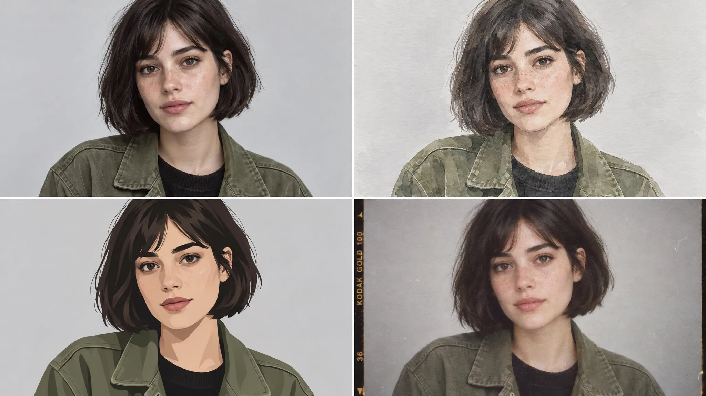

# Four-style reference grid of the same person

**中文标题：** 同一人物四风格对照网格  
**ID:** `gi25-char-006` · **Mode:** `edit`  
**Categories:** `character-consistency`  
**Tags:** `felo`, `vendor-blog`, `gpt-image-2.5`, `style-grid`, `reference`



### Four-style reference grid of the same person

```text
Create a four-panel grid of the same person from the reference photo:
photorealistic portrait, loose watercolour, flat vector illustration, and 1990s film photograph.
Keep the same face, the same short dark bob, and the same olive jacket in all four panels.
Evenly spaced panels, identical framing and head size, neutral light-grey background.
Constraints: no text, no watermark, no style blending between panels.
```

- **Recommended model:** `gpt-image-2.5-sunburst`
- **Settings:** _(defaults)_
- **Source:** [vendor-blog](https://felo.ai/blog/gpt-image-2-5-use-cases/) — Felo Search Blog
- **License note:** Felo blog copy-paste examples; remix with attribution
- **Notes:** Copy-paste GPT Image 2.5 use-case prompt from Felo Search Blog (2026-09-10); not previously in this repo.
