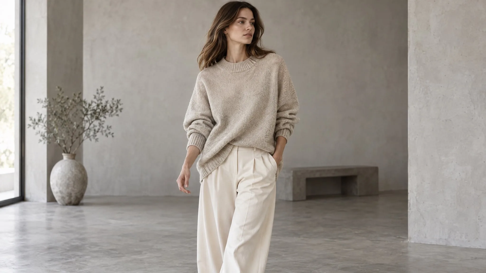

# Oatmeal knit sweater lookbook on-model shot

**中文标题：** 燕麦针织毛衣 Lookbook 上身图  
**ID:** `gi25-eco-018` · **Mode:** `edit`  
**Categories:** `ecommerce`, `character-consistency`  
**Tags:** `felo`, `vendor-blog`, `gpt-image-2.5`, `lookbook`, `on-model`



### Oatmeal knit sweater lookbook on-model shot

```text
Editorial e-commerce photograph of a model wearing the oversized oatmeal knit sweater
and wide-leg cream trousers from the reference images. Mid-shot, mid-stride, three-quarter angle.
Keep garment colour, texture, and silhouette exactly as in the reference.
Light: soft daylight in a minimal concrete studio, gentle shadow, neutral colour balance.
Style: catalogue lookbook photography, shallow depth of field, natural fabric folds.
Constraints: no text, no watermark, no pattern changes, no extra accessories.
```

- **Recommended model:** `gpt-image-2.5-sunburst`
- **Settings:** _(defaults)_
- **Source:** [vendor-blog](https://felo.ai/blog/gpt-image-2-5-use-cases/) — Felo Search Blog
- **License note:** Felo blog copy-paste examples; remix with attribution
- **Notes:** Copy-paste GPT Image 2.5 use-case prompt from Felo Search Blog (2026-09-10); not previously in this repo.
