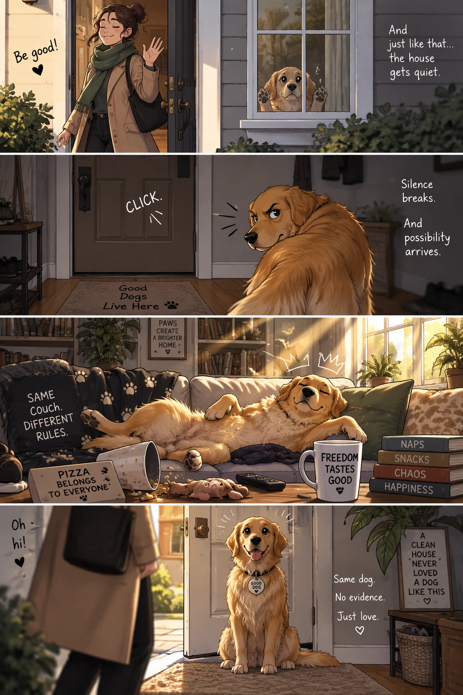

# Four-panel pet comic reel

**中文标题：** 四格宠物漫画竖屏  
**ID:** `gi25-gen-004` · **Mode:** `generate`  
**Categories:** `character-consistency`, `general`  
**Tags:** `comic`, `narrative`, `openai-official`  



### Four-panel pet comic reel

```text
Create a short vertical comic-style reel with 4 panels.
Panel 1: The owner leaves through the front door. The pet is framed in the window behind them, small against the glass, eyes wide, paws pressed high, the house suddenly quiet.
Panel 2: The door clicks shut. Silence breaks. The pet slowly turns toward the empty house, posture shifting, eyes sharp with possibility.
Panel 3: The house transformed. The pet sprawls across the couch like it owns the place, crumbs nearby, sunlight cutting across the room like a spotlight.
Panel 4: The door opens. The pet is seated perfectly by the entrance, alert and composed, as if nothing happened.
```

- **Recommended model:** `either`
- **Settings:** `quality=medium`, `size=1024x1536`
- **Source:** [OpenAI Image prompting](https://developers.openai.com/api/docs/guides/image-prompting) — OpenAI
- **License note:** OpenAI docs examples
