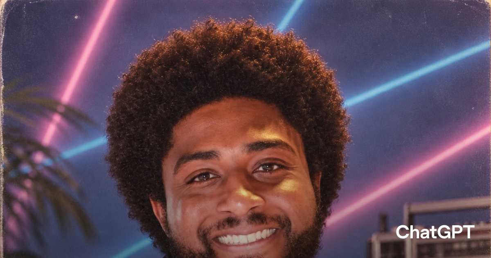

# Neon 80s Portrait (viral shared prompt)

**中文标题：** 霓虹八十年代肖像（病毒式分享提示词）  
**ID:** `gi25-gen-009` · **Mode:** `edit`  
**Categories:** `general`, `character-consistency`  
**Tags:** `viral`, `80s`, `chatgpt-share`, `openai`



### Neon 80s Portrait (viral shared prompt)

```text
Show me what I would look like if I was in the '80s
```

- **Recommended model:** `gpt-image-2.5-flare`
- **Settings:** `size`=`1024x1536`
- **Source:** [ChatGPT share](https://chatgpt.com/s/p_659f135ed2ec8191a208f4f16a769813) — OpenAI / ChatGPT shared prompt
- **License note:** ChatGPT shared prompt; Linked from OpenAI Images 2.5 announcement
- **Notes:** Featured as the viral ’80s example on openai.com/index/introducing-chatgpt-images-2-5/. Short identity-restyle prompt intended with a selfie reference.
