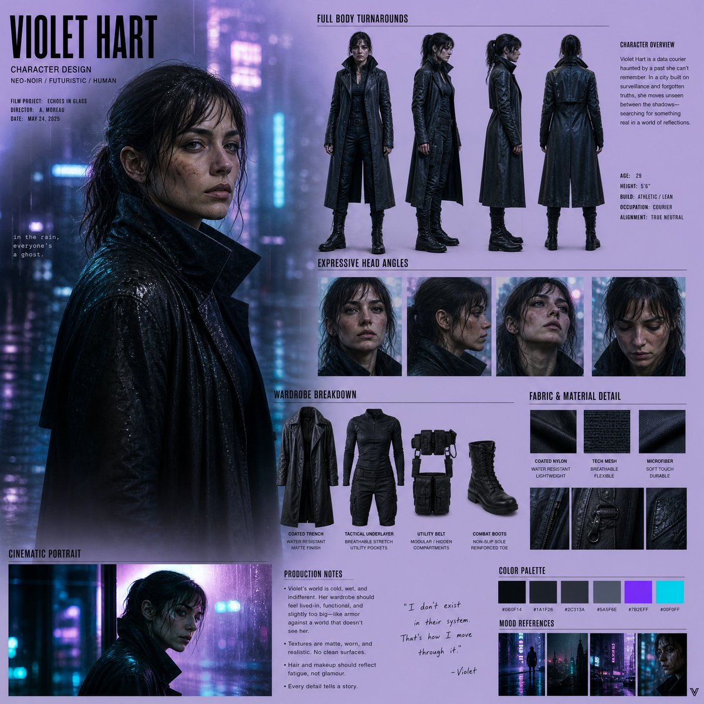

# Neo-Noir Character Design Board

**中文标题：** 新黑色电影角色设定板  
**ID:** `gi25-x-008` · **Mode:** `generate`  
**Categories:** `character-consistency`, `ui-mockup`  
**Tags:** `x-twitter`, `evolink`, `community`, `gpt-image-2`



### Neo-Noir Character Design Board

```text
Create a cinematic realistic character design board for a high-budget neo-noir film production set in a rain-soaked futuristic city. Use a dark charcoal and electric cyan color palette with neon reflections in the background. Avoid generic grids or symmetrical layouts; composition should feel like a stylized director’s pitch board. Design a grounded human character with realistic anatomy, subtle imperfections, and strong emotional presence. Include full-body turnarounds, expressive head angles, cinematic portrait, wardrobe breakdown, fabric texture detail, and production notes. Background: blurred cyberpunk city lights, wet glass reflections, moody atmosphere, soft neon glow. Style: semi-realistic cinematic realism, high contrast lighting, shallow depth of field, film grain, emotional intensity.
```

- **Recommended model:** `either`
- **Settings:** _(defaults)_
- **Source:** [X/Twitter](https://x.com/Mind_Boticni/status/2054542152781431075) — @Mind_Boticni (via EvoLinkAI)
- **License note:** CC0-1.0 (EvoLink catalog); original X post — remix with attribution
- **Notes:** Mirrored in EvoLink case 388 (ui.md); original post on X.
