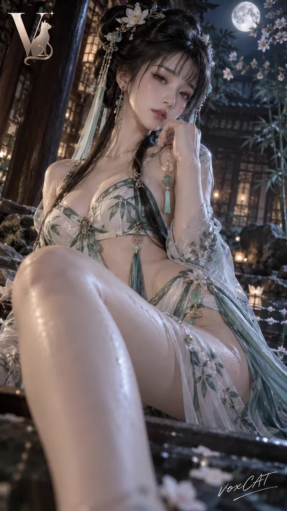

# Low-angle fantasy character fashion photography

**中文标题：** 低机位奇幻角色时尚摄影  
**ID:** `gi25-x-024` · **Mode:** `generate`  
**Categories:** `character-consistency`, `general`  
**Tags:** `x-twitter`, `community`, `gpt-image-2.5`, `liuyaanng`



### Low-angle fantasy character fashion photography

```text
image2.5人像测试

{角色}，明确成年角色，时尚杂志级低机位 Editorial 角色摄影 × 高级奇幻人像。保留角色标志性发型、服装、饰品、兽耳、武器或职业符号，并转译为真实高定 COS / fashion editorial 造型。人物斜倚、半坐或侧坐，一侧膝腿靠近镜头形成自然前景透视与近大远小效果，脸部位于画面中上区域，微侧头、垂眸、浅笑或冷静凝视。35–50mm 近距离低机位拍摄，浅景深，局部自然越框。背景根据角色设定自动适配为暗色东方建筑、奇幻室内、月夜庭院或高级舞台空间。暖金/柔白主光塑造面部，洋红或角色代表色轮廓光勾勒发丝与服装边缘，少量冷蓝环境光分离背景；轻 halation，真实细腻肤质，干净暗部，高级时尚杂志调色，无短视频压缩感。左上角加入 stylized “V” × 猫元素 Logo，右下角加入手写签名“voxCAT”，服装或配件可加入低调 VOXCAT 织标或金属铭牌。9:16 竖版，画面干净清晰，细节稳定。
```

- **Recommended model:** `either`
- **Settings:** _(defaults)_
- **Source:** [X/Twitter](https://x.com/VoxcatAI/status/2097416442220290078) — @VoxcatAI (via liuyaanng/awesome-gpt-image-2.5)
- **License note:** Community X post mirrored in awesome-gpt-image-2.5; remix with attribution
- **Notes:** Community X prompt #010 (portrait photography) curated in liuyaanng/awesome-gpt-image-2.5 docs/prompts/community-x.md; original on X.
