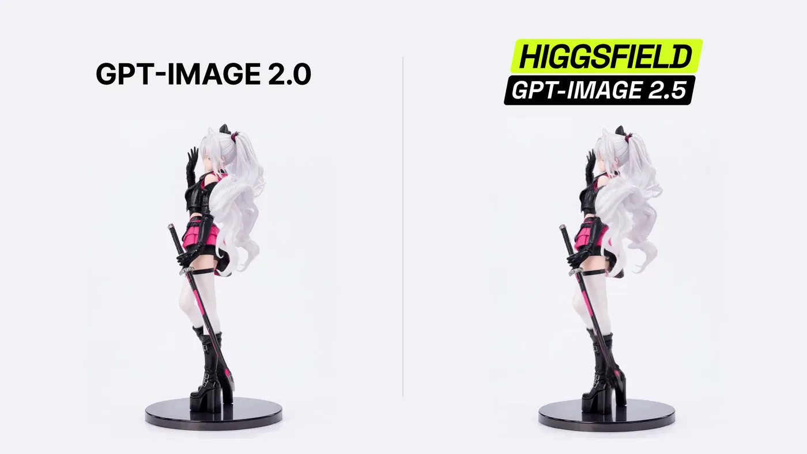

# Resin figure 360° split-screen animation

**中文标题：** 树脂手办 360° 分屏动画  
**ID:** `gi25-x-032` · **Mode:** `generate`  
**Categories:** `character-consistency`  
**Tags:** `x-twitter`, `community`, `gpt-image-2.5`, `liuyaanng`



### Resin figure 360° split-screen animation

```text
Comparing GPT-Image 2.0 to GPT-Image 2.5

Sharing the prompt:

"Create a continuous 6-second split-screen animation from the supplied image. Preserve both matching silver-haired gothic anime resin figures and all facial, costume, hair, sword, boot, and base details. Use two equal panels with synchronized motion. Both figures must simultaneously rotate clockwise with their bases through one full 360° turn at 60°/s while gesturing: front at 0s, side at 1.5s, back at 3s, opposite side at 4.5s, and front at 6s. From 0–2s, wave the free right hand beside the face; from 2–4s, brush the hair back with a slight head tilt; from 4–6s, lower the hand to the hip and end in a confident front-facing pose with a soft smile. Keep the left hand holding the fully sheathed katana downward and both feet fixed to the rotating base. Preserve smooth articulation, subtle secondary motion, and the painted-resin finish. Keep both complete figures and bases visible against a near-white studio background. Camera, lighting, scale, divider, and turntable centers stay fixed. No cuts, reversals, camera movement, extra objects, text, watermark, graphics, or audio."
```

- **Recommended model:** `gpt-image-2.5-sunburst`
- **Settings:** _(defaults)_
- **Source:** [X/Twitter](https://x.com/higgsfield/status/2097486959296057609) — @higgsfield (via liuyaanng/awesome-gpt-image-2.5)
- **License note:** Community X post mirrored in awesome-gpt-image-2.5; remix with attribution
- **Notes:** Community X prompt #067 (characters stickers) curated in liuyaanng/awesome-gpt-image-2.5 docs/prompts/community-x.md; original on X.
