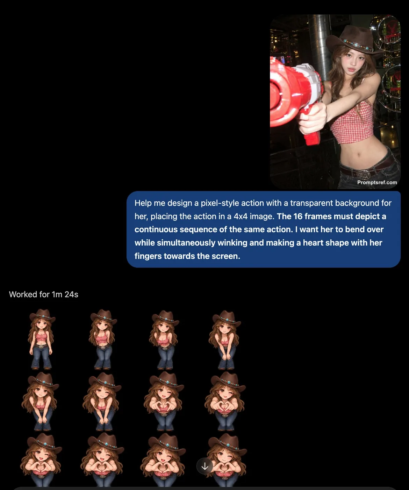

# Reusable 16-frame sprite sheet template

**中文标题：** 可复用 16 帧精灵表模板  
**ID:** `gi25-x-033` · **Mode:** `generate`  
**Categories:** `character-consistency`  
**Tags:** `x-twitter`, `community`, `gpt-image-2.5`, `liuyaanng`



### Reusable 16-frame sprite sheet template

```text
Create a pixel-art animation sprite sheet of the character in the reference image, with a transparent background. Arrange 16 frames in a 4×4 grid, ordered from left to right, top to bottom. All 16 frames must form one continuous sequence of the same action, with smooth transitions between adjacent frames. Keep the character’s appearance, scale, and alignment consistent throughout. The action: [describe your desired action].
```

- **Recommended model:** `gpt-image-2.5-sunburst`
- **Settings:** _(defaults)_
- **Source:** [X/Twitter](https://x.com/underwoodxie96/status/2097554154554314891) — @underwoodxie96 (via liuyaanng/awesome-gpt-image-2.5)
- **License note:** Community X post mirrored in awesome-gpt-image-2.5; remix with attribution
- **Notes:** Community X prompt #071 (characters stickers) curated in liuyaanng/awesome-gpt-image-2.5 docs/prompts/community-x.md; original on X.
