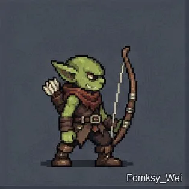

# Sixteen-frame goblin archer sprite sheet

**中文标题：** 十六帧哥布林弓箭手精灵图  
**ID:** `gi25-x-054` · **Mode:** `generate`  
**Categories:** `character-consistency`  
**Tags:** `x-twitter`, `community`, `gpt-image-2.5`, `liuyaanng`, `pixel`, `sprite-sheet`



### Sixteen-frame goblin archer sprite sheet

```text
不要使用技能,制作做一张精灵图
这张图包含一名像素风男性哥布林拉弓箭射出的过程
总计16帧.
然后将该图切图,并制作成永动gif
```

- **Recommended model:** `gpt-image-2.5-sunburst`
- **Settings:** _(defaults)_
- **Source:** [X/Twitter](https://x.com/Fomsky_Wei/status/2097559943075533257) — @Fomsky_Wei (via liuyaanng/awesome-gpt-image-2.5)
- **License note:** Community X post mirrored in awesome-gpt-image-2.5; remix with attribution
- **Notes:** Community X prompt #022 (characters stickers) curated in liuyaanng/awesome-gpt-image-2.5; same thread may hold multiple prompts; original on X.
