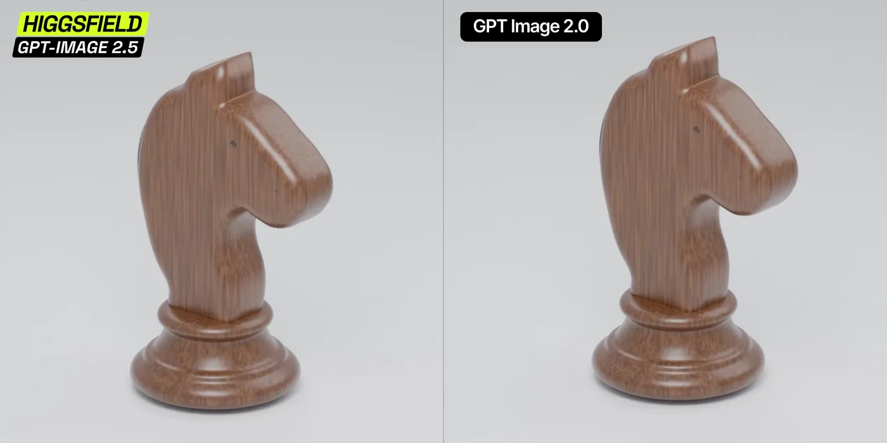

# Wooden chess knight 360° turntable

**中文标题：** 木质国际象棋骑士 360° 转台  
**ID:** `gi25-x-071` · **Mode:** `generate`  
**Categories:** `character-consistency`, `ecommerce`  
**Tags:** `x-twitter`, `community`, `gpt-image-2.5`, `liuyaanng`, `turntable`, `product`



### Wooden chess knight 360° turntable

```text
Create a photorealistic studio turntable video of a polished wooden chess knight.

The knight has a minimalist carved horse silhouette: broad flat sides, a rounded elongated muzzle, a tiny dark eye, an angular ear, and a gently curved neck. A smooth, dark brown insert follows the mane along the back. The figure stands on a wide circular wooden base with several concentric stepped rings.

Use warm brown wood with clearly visible vertical grain, softly rounded edges, and a glossy lacquer finish. Preserve the exact shape, proportions, wood grain, and dark mane insert throughout the video.

The entire chess piece, including its base, rotates smoothly through one complete 360-degree turn around its vertical axis at a constant speed. It stays perfectly centered and firmly on the surface. The first and last frames match for a seamless loop.

Keep the camera completely stationary, looking slightly downward at the piece. Show the entire object with a small margin above and below. Use a seamless light-gray studio background and floor, soft diffused lighting, gentle highlights on the lacquer, and a subtle contact shadow beneath the base.

Duration: 3 seconds. Frame rate: 30 fps. Square 1:1 composition.

No camera movement, zoom, cuts, wobbling, floating, deformation, changing proportions, sliding wood textures, flickering, additional objects, text, or logos.
```

- **Recommended model:** `gpt-image-2.5-sunburst`
- **Settings:** _(defaults)_
- **Source:** [X/Twitter](https://x.com/higgsfield/status/2097519422407872858) — @higgsfield (via liuyaanng/awesome-gpt-image-2.5)
- **License note:** Community X post mirrored in awesome-gpt-image-2.5; remix with attribution
- **Notes:** Community X prompt #066 (product ads) curated in liuyaanng/awesome-gpt-image-2.5; same thread may hold multiple prompts; original on X.
