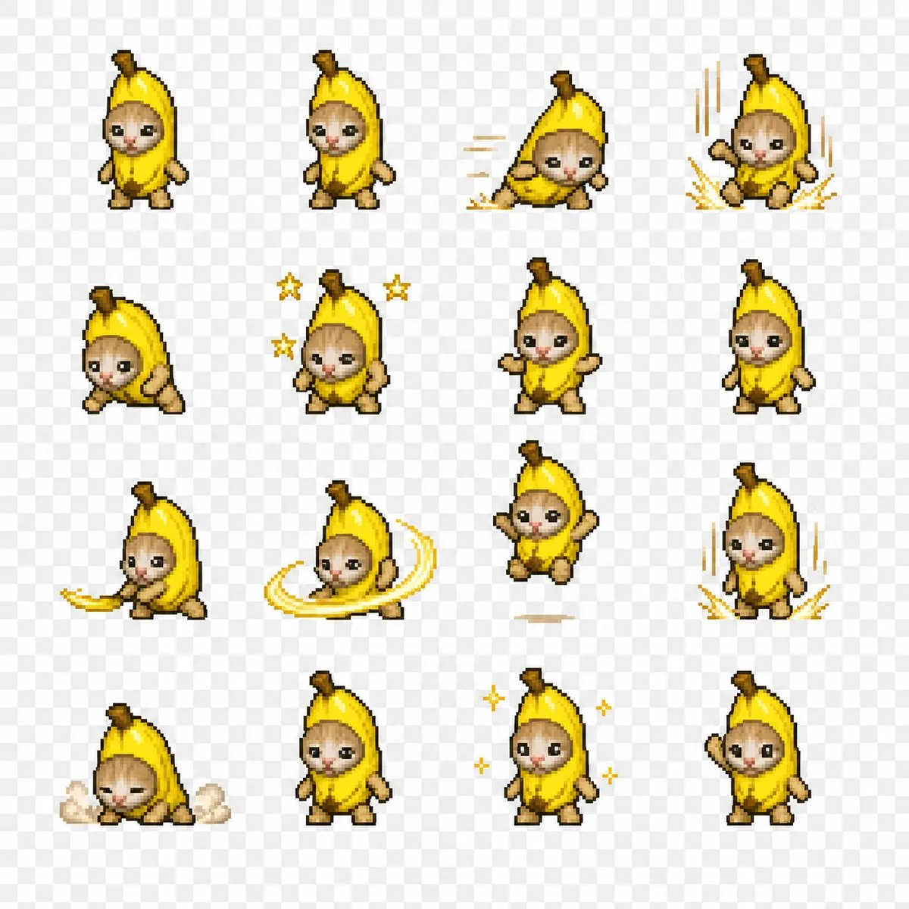

# 128px combat-return sprite sheet

**中文标题：** 128px 战斗归来精灵图  
**ID:** `gi25-x-073` · **Mode:** `edit`  
**Categories:** `character-consistency`  
**Tags:** `x-twitter`, `community`, `gpt-image-2.5`, `liuyaanng`, `pixel`, `sprite-sheet`



### 128px combat-return sprite sheet

```text
Create a simplified 128-pixel pixel art for the character, depicting their combat return animation. If possible, make it transparent. Arrange them in a 4x4 grid.
```

- **Recommended model:** `gpt-image-2.5-sunburst`
- **Settings:** _(defaults)_
- **Source:** [X/Twitter](https://x.com/HitPawofficial/status/2097570316679884838) — @HitPawofficial (via liuyaanng/awesome-gpt-image-2.5)
- **License note:** Community X post mirrored in awesome-gpt-image-2.5; remix with attribution
- **Notes:** Community X prompt #070 (characters stickers) curated in liuyaanng/awesome-gpt-image-2.5; same thread may hold multiple prompts; original on X.
