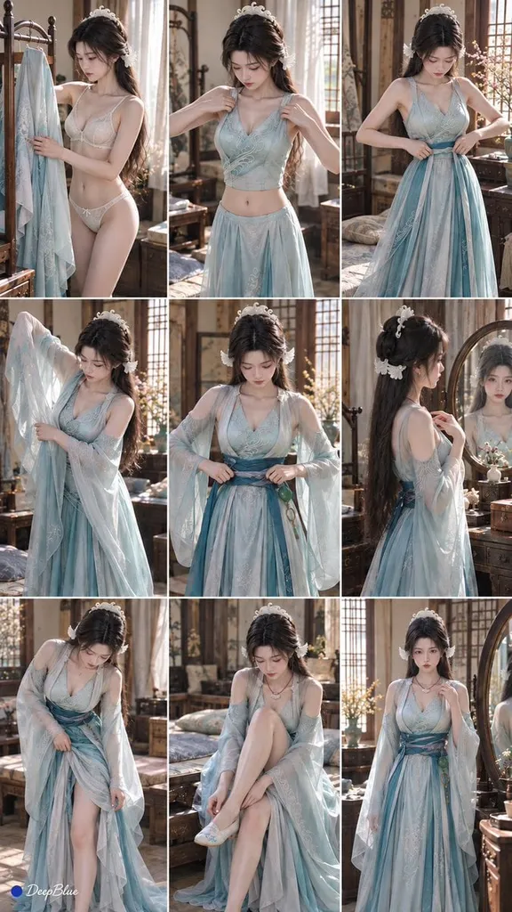

# Ancient Chinese Fashion Photography Grid

**中文标题：** 宋式穿衣全过程九宫格摄影  
**ID:** `gi25-x-087` · **Mode:** `generate`  
**Categories:** `character-consistency`, `general`  
**Tags:** `x-twitter`, `community`, `gpt-image-2.5`, `renoise`, `layout-&-typography`, `zh`

### Ancient Chinese Fashion Photography Grid

```text
【宋玉穿衣全过程｜宋式闺房】

专业高级古风时尚摄影；9:16竖版完整画布，内部严格3列×3行九宫格，每格等比例、尺寸一致、间距细窄整齐；每格人物均以全身或接近全身构图为主，确保完整呈现服装穿着变化。
```

- **Recommended model:** `gpt-image-2.5-sunburst`
- **Settings:** _(defaults)_
- **Source:** [community](https://x.com/DeepBlueX0/status/2097630845435572490) — @DeepBlueX0 (via renoise-ai/awesome-gpt-image-2-5-prompts)
- **License note:** Community X post mirrored in renoise-ai/awesome-gpt-image-2-5-prompts; remix with attribution
- **Notes:** Community X prompt curated in renoise-ai/awesome-gpt-image-2-5-prompts (ancient-chinese-fashion-photography-grid); original on X; published 2026-09-09.



