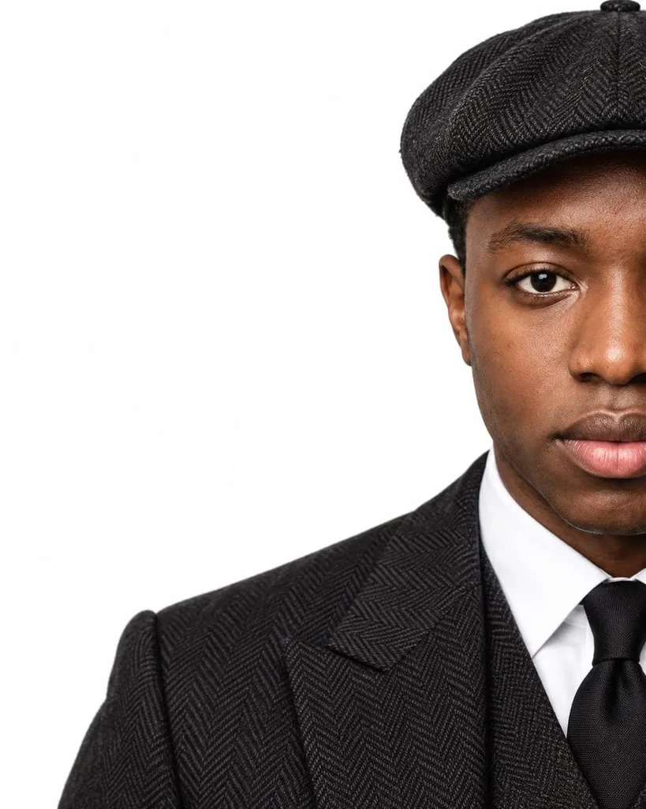

# Asymmetric High-Fashion Studio Portrait

**中文标题：** 非对称高级时装棚拍人像  
**ID:** `gi25-x-090` · **Mode:** `generate`  
**Categories:** `edit-change-preserve`, `character-consistency`  
**Tags:** `x-twitter`, `community`, `gpt-image-2.5`, `renoise`, `style-&-intelligence`, `en`

### Asymmetric High-Fashion Studio Portrait

```text
Create a high-fashion editorial close-up portrait of an adult man against a seamless pure white studio background. Use an intentionally asymmetric composition:
```

- **Recommended model:** `gpt-image-2.5-sunburst`
- **Settings:** _(defaults)_
- **Source:** [community](https://x.com/abs_uiux/status/2097584540382593530) — @abs_uiux (via renoise-ai/awesome-gpt-image-2-5-prompts)
- **License note:** Community X post mirrored in renoise-ai/awesome-gpt-image-2-5-prompts; remix with attribution
- **Notes:** Community X prompt curated in renoise-ai/awesome-gpt-image-2-5-prompts (asymmetric-high-fashion-studio-portrait); original on X; published 2026-09-09.



