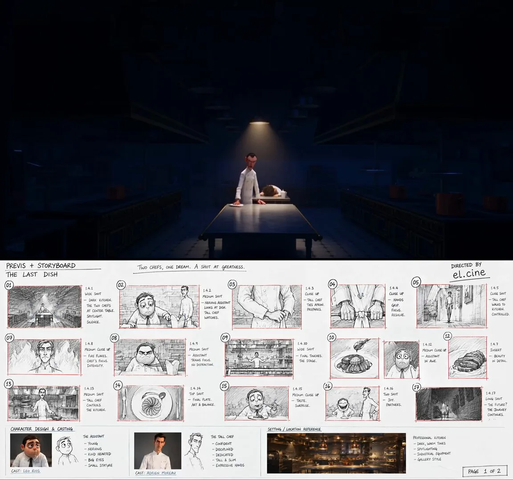

# Animation character sheet: GUEST

**中文标题：** 动画角色设定表：GUEST 客人  
**ID:** `gi25-x-105` · **Mode:** `generate`  
**Categories:** `character-consistency`  
**Tags:** `x-twitter`, `community`, `gpt-image-2.5`, `liuyaanng`, `characters-stickers`

### Animation character sheet: GUEST

```text
ChatGPT Image 2.5 is crazy for storytelling..

it turns any idea into detailed storyboard with cast design.. then use seedance 2.5 to make a full film scene..

check free workflow and prompts 👇 https://t.co/p1l1PxZEZb
```

- **Recommended model:** `gpt-image-2.5-sunburst`
- **Settings:** _(defaults)_
- **Source:** [community](https://x.com/EHuanglu/status/2097519538632024103) — @EHuanglu (via liuyaanng/awesome-gpt-image-2.5)
- **License note:** Community X post mirrored in awesome-gpt-image-2.5; remix with attribution
- **Notes:** Community X prompt curated in liuyaanng/awesome-gpt-image-2.5 (#27); original on X.



