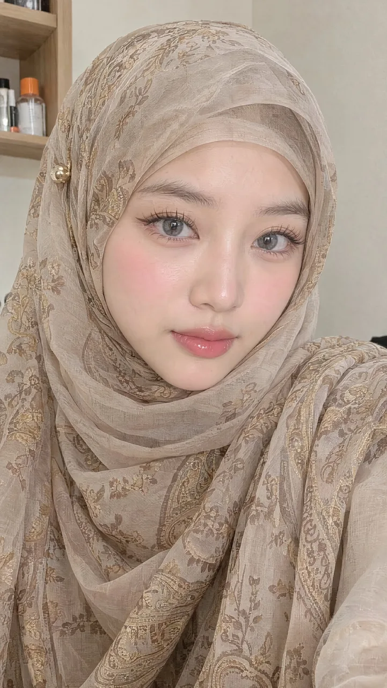

# Soft Hijab Beauty Portrait

**中文标题：** 柔光头巾美妆人像  
**ID:** `gi25-x-151` · **Mode:** `generate`  
**Categories:** `character-consistency`, `general`  
**Tags:** `x-twitter`, `community`, `gpt-image-2.5`, `seeapi`, `en`



### Soft Hijab Beauty Portrait

```text
A close-up portrait of a young East Asian woman with fair, smooth porcelain skin and a soft, even complexion. She has large, almond-shaped light gray-blue eyes with long, dark, defined eyelashes and subtle eyeliner. Her eyebrows are slender and neatly shaped. She wears natural, dewy makeup with a soft pink blush on the cheeks and glossy, slightly plump rose-pink lips. She looks directly at the camera with a calm, gentle, slightly reserved expression.

She is wearing a sheer, lightweight hijab in muted beige, taupe, and champagne tones with an intricate paisley and floral pattern in gold and brown. The fabric is draped loosely and layered around her head and shoulders, covering all of her hair. A small gold spherical pin or brooch is visible on the left side of the hijab near her temple. The fabric has a soft, slightly translucent quality with gentle folds and texture.

The background is an indoor setting with a light-colored wall and a wooden shelf visible in the upper left, holding a few bottles (one with an orange cap). Soft, natural indoor lighting creates a warm, flattering glow on her face with no harsh shadows.

Photorealistic, high-detail beauty portrait, shallow depth of field, soft focus on the background, elegant and modest styling.
```

- **Recommended model:** `gpt-image-2.5-sunburst`
- **Settings:** _(defaults)_
- **Source:** [community](https://x.com/woleswoosh/status/2099774470374502450) — @woleswoosh (via SeeAPI/awesome-gpt-image-2.5-prompts)
- **License note:** Community X post mirrored in SeeAPI/awesome-gpt-image-2.5-prompts; remix with attribution
- **Notes:** SeeAPI P49
