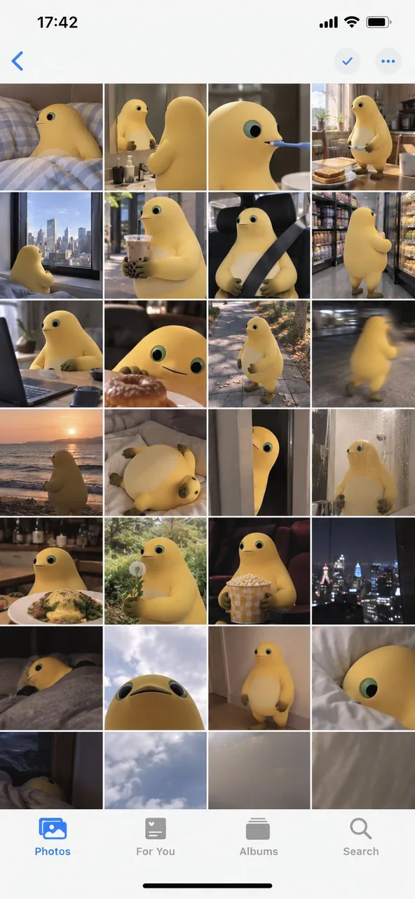

# iPhone Day-in-the-Life Camera Roll

**中文标题：** iPhone 一日生活相机胶卷截图  
**ID:** `gi25-x-154` · **Mode:** `edit`  
**Categories:** `character-consistency`, `edit-change-preserve`  
**Tags:** `x-twitter`, `community`, `gpt-image-2.5`, `seeapi`, `en`



### iPhone Day-in-the-Life Camera Roll

```text
Use the uploaded image as the ONLY subject reference.

Create ONE vertical image that looks exactly like a screenshot of the iPhone Photos app, showing one full day of casual camera-roll photos featuring the exact subject from the uploaded reference.

SUBJECT CONSISTENCY
First identify the main subject in the uploaded image. It may be a person, anime character, pet, animal, plush toy, figurine, mascot, object, or other character.

Preserve the subject’s recognizable appearance, colors, proportions, facial features, hairstyle, clothing, accessories, markings, materials, and signature details consistently across every photo.

If the reference contains multiple views of the same subject, understand that they are different views of ONE subject, not multiple characters.

Do not redesign or replace the subject.

DAY-IN-THE-LIFE CAMERA ROLL
Imagine a believable full day for this exact subject based on its appearance, personality, style, and visual world.

Generate many different casual photos from morning to night, as if someone naturally photographed the subject throughout the day.

Automatically choose everyday situations that fit the uploaded subject, such as:
waking up, resting, eating, sitting by a window, traveling, walking outside, visiting cafés or shops, playing, working, relaxing at home, interacting with everyday objects, sunset moments, nighttime outings, and going to sleep.

The activities and environments should adapt naturally to the subject. Do not force human activities onto animals, toys, objects, or non-human characters when they would look unnatural.

Every thumbnail should show a different moment, composition, distance, pose, camera angle, lighting condition, or location.

Mix:
close-ups,
medium shots,
wide shots,
overhead photos,
back views,
detail shots,
slightly blurry movement shots,
imperfect handheld snapshots,
photos where the subject is partially cropped,
environmental photos related to the subject’s day.

The result should feel spontaneous and personal rather than like a professional photoshoot.

IPHONE PHOTOS APP LAYOUT
The FINAL IMAGE itself must look like a real full-screen iPhone Photos app screenshot.

Use a tall smartphone screenshot aspect ratio, approximately 9:19.5.

Create a dense camera-roll gallery using FOUR equal thumbnail columns, closely matching the standard iPhone Photos grid.

Include approximately 24–32 individual photo thumbnails visible on screen.

Use very thin white gaps between thumbnails.

The gallery should fill most of the screen vertically.

Include authentic iPhone Photos interface elements:
• white iOS interface background
• iPhone-style status bar at the top
• time on the upper left
• cellular/Wi-Fi/battery icons on the upper right
• simple navigation controls near the top
• four-column photo gallery
• bottom Photos app navigation bar
• Photos tab selected in blue
• other navigation icons shown in gray
• black home indicator at the very bottom

The UI must look like an actual screenshot of the Photos app, NOT a decorative frame, moodboard, contact sheet, scrapbook, poster, or generic collage.

PHOTO STYLE
Make each thumbnail feel like a genuine casual iPhone camera-roll photo.

Use natural everyday lighting, imperfect framing, realistic exposure variation, occasional motion blur, slight focus imperfections, spontaneous compositions, and believable environmental details.

Keep the same subject recognizable throughout the entire gallery while allowing natural changes in pose, expression, camera distance, and lighting.

If the uploaded reference is illustrated, animated, stylized, or 3D, preserve its original visual identity and style unless realistic photography is explicitly requested.

IMPORTANT
ONE final image only.
The entire output is ONE iPhone Photos app screenshot containing many different photos.
Exactly FOUR thumbnail columns.
Do not create a standalone collage without the iPhone interface.
Do not create multiple separate outputs.
Do not duplicate the exact same photo repeatedly.
Do not introduce unrelated characters or subjects.
Do not change the main subject’s design.
No captions, dates, labels, stickers, watermarks, or decorative text inside the photo thumbnails.
Only normal minimal iOS interface elements may appear.

9:16
```

- **Recommended model:** `gpt-image-2.5-sunburst`
- **Settings:** _(defaults)_
- **Source:** [community](https://x.com/Mayz1169/status/2099479873027031442) — @Mayz1169 (via SeeAPI/awesome-gpt-image-2.5-prompts)
- **License note:** Community X post mirrored in SeeAPI/awesome-gpt-image-2.5-prompts; remix with attribution
- **Notes:** SeeAPI P52
