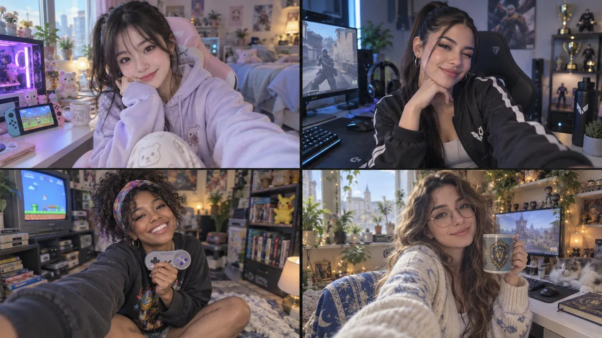

# Female Gaming Influencer 2x2 Frame Template

**中文标题：** 女游戏 influencer 2×2：可复用 influencer_frame 模板  
**ID:** `gi25-x-165` · **Mode:** `generate`  
**Categories:** `character-consistency`, `poster-typography`  
**Tags:** `x-twitter`, `community`, `gpt-image-2.5`, `xianyu`, `en`



### Female Gaming Influencer 2x2 Frame Template

```text
2x2 grid, 16:9, do this for 4 female gaming influencers with poses that steal your heart. // FN: influencer_frame(SUBJECT, SETTING, TIME, RIG, PLATFORM, INTENT)  // Edit INPUT only. Everything below derives.  INPUT   SUBJECT  = " $ subject"    SETTING  = "Ai infers"    TIME     = "Ai infers"   RIG      = SELF            // SELF | FRIEND | TRIPOD | MIRROR | DRONE   PLATFORM = IG_FEED         // IG_FEED | IG_STORY | TIKTOK | PINTEREST   INTENT   = "candid morning"   INFER :: RIG → geometry, gaze, and what the fiction is   SELF    → 23mm front, 45–60cm, face widened ~8%, lens ABOVE eye level,             chin foreshortened, gaze INTO lens, one arm's angle implied by crop   FRIEND  → 26mm rear, 1.5–3m, correct proportion, eye level, gaze into lens,             full body possible, environment legible   TRIPOD  → 26mm, 2–4m, gaze deliberately AWAY (the candid fiction), body             squared to a mark on the ground, static pose held for a burst   MIRROR  → phone IN FRAME, screen glow on face/hands, gaze at reflection NOT             lens, room reversed, fingerprints on the glass   DRONE   → 24mm from above, subject small, the LOCATION is the subject  INFER :: SETTING + TIME → light class → computational behavior   interior_backlit  → HDR stack: window keeps detail, never clips; edge halo   golden_hour       → warm, long shadows, veiling flare, lifted blacks   overcast          → flat, cool, low contrast, no shadow direction   night_artificial  → night mode: multi-second stack ⇒ anything that moved                       ghosts; shadows unnaturally lit; grain scrubbed to plastic   harsh_noon        → HDR fights it: raccoon shadows lifted, skin looks flat  INFER :: PLATFORM → container   IG_FEED  = 4:5,  1080px ceiling, mild re-encode   IG_STORY = 9:16, safe zones top/bottom kept empty   TIKTOK   = 9:16, heavier compression, saturation pushed   PINTEREST= 2:3,  text overlay space reserved  DERIVE :: always, regardless of input   D1 synthetic depth ⇒ mask errors mandatory: one hair-gap filled with blur,      a ~2px halo at the shoulder, blur bucketed by depth not continuous   D2 beauty pass ⇒ cheeks poreless WHILE lashes/brows stay razor sharp   D3 grade ⇒ blacks lifted to ~12/255 with cyan bias, nothing pure black   D4 INTENT ⇒ props staged: labels rotated to camera, food untouched,      "unnoticed" objects squared to the table edge  FORBIDDEN   ✗ true optical bokeh falloff        ✗ clipped white window   ✗ uniform skin sharpness            ✗ pure black   ✗ DSLR micro-detail at 1080         ✗ genuine unawareness of the camera  RENDER  // resolve every {slot}, emit prose only   {PLATFORM.aspect} phone photo. {SUBJECT} at {SETTING}, {TIME}.   {RIG.geometry_prose}. {light_class.prose}. Background blurred the artificial   way phones do it, with {D1}. {D2}. {D3}. {D4}. Slightly soft at 1080px.  AUDIT   window_luma_max < 250 · cheek_highfreq << lash_highfreq   ≥1 segmentation halo · black_point > 8/255 · gaze matches RIG
```

- **Recommended model:** `gpt-image-2.5-sunburst`
- **Settings:** _(defaults)_
- **Source:** [community](https://x.com/Gdgtify/status/2100581539008626771) — @Gdgtify (via xianyu110/awesome-gpt-image2.5)
- **License note:** Community X post mirrored in xianyu110/awesome-gpt-image2.5; remix with attribution
- **Notes:** xianyu110/awesome-gpt-image2.5 case 2100581539008626771; category=人像角色.
