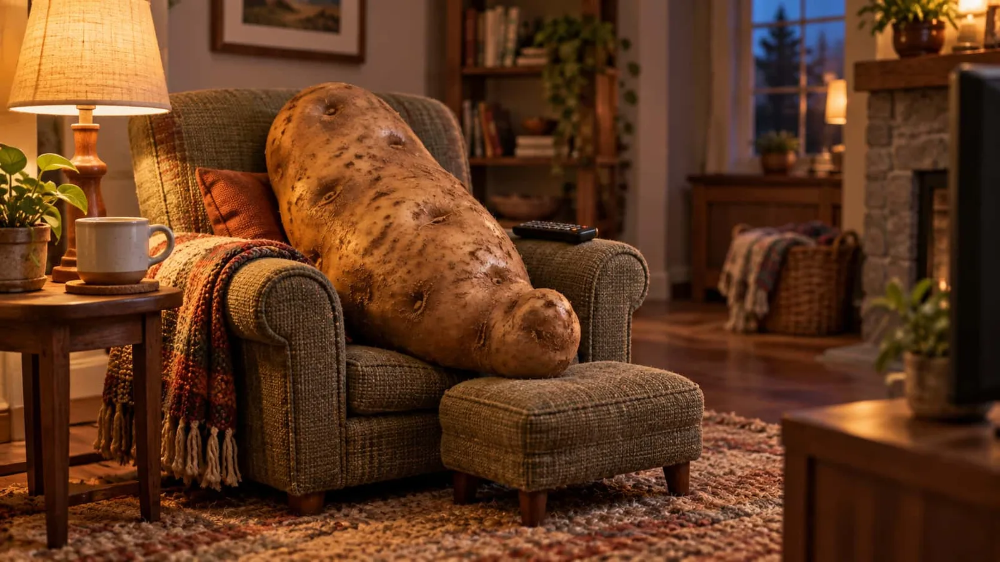

# Couch Potato Miniature Set

**中文标题：** 懒人土豆微缩客厅  
**ID:** `gi25-x-171` · **Mode:** `generate`  
**Categories:** `character-consistency`, `general`  
**Tags:** `x-twitter`, `community`, `gpt-image-2.5`, `seeapi`, `en`



### Couch Potato Miniature Set

```text
One oversized russet potato reclines in a tiny upholstered armchair, with its naturally knobbly lower half resting on an ottoman and a television remote beside it. Miniature set photography, eye-level view and warm evening lamplight, preserving realistic potato skin and a comfortably lazy posture in an unlettered living room.. 16:9 wide composition.
```

- **Recommended model:** `gpt-image-2.5-sunburst`
- **Settings:** _(defaults)_
- **Source:** [community](https://x.com/unrealpixels/status/2100662656835420370) — @unrealpixels (via SeeAPI/awesome-gpt-image-2.5-prompts)
- **License note:** Community X post mirrored in SeeAPI/awesome-gpt-image-2.5-prompts; remix with attribution
- **Notes:** SeeAPI P66 (p66-couch-potato-miniature-set)
