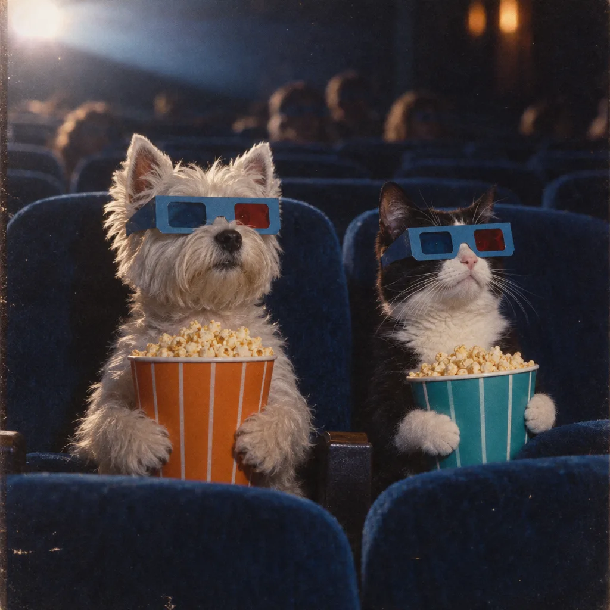

# Cinema Pets with 3D Glasses

**中文标题：** 戴 3D 眼镜的影院宠物  
**ID:** `gi25-x-188` · **Mode:** `generate`  
**Categories:** `character-consistency`, `general`  
**Tags:** `community`, `gpt-image-2.5`, `seeapi`, `en`



### Cinema Pets with 3D Glasses

```text
A West Highland White Terrier and a white-and-black cat sitting side by side in a dark movie theater, both wearing vintage blue cardboard 3D glasses, each holding a full bucket of buttered popcorn (warm orange bucket for the dog, teal bucket for the cat), deep blue velvet cinema seats filling the foreground and background rows, low-key screen light hitting their faces from the front-left, shallow depth of field, 1970s film photograph aesthetic, faded Kodak color, heavy grain and dust speckles, slightly soft focus, square 1:1 crop, centered symmetrical composition with both animals looking off-screen toward the screen, nostalgic and quietly humorous mood. Negative: modern digital sharpness, HDR, cartoon style, human hands, text, watermark, distorted eyes.
```

- **Recommended model:** `gpt-image-2.5-sunburst`
- **Settings:** _(defaults)_
- **Source:** [community](https://tryclico.com/gallery/double-feature) — Author unconfirmed (via SeeAPI/awesome-gpt-image-2.5-prompts)
- **License note:** Community gallery item mirrored in SeeAPI/awesome-gpt-image-2.5-prompts; remix with attribution; authorship per SeeAPI notes
- **Notes:** SeeAPI P83 (p83-cinema-pets-with-3d-glasses)
