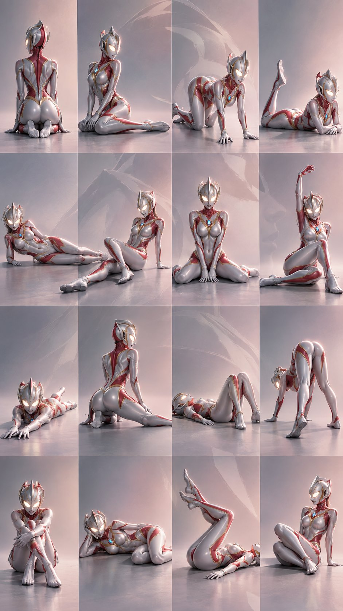

# No-Reference 16-Panel Editorial Pose Sheet 【XXX】

**中文标题：** 无参考姿势图×16宫格 Editorial：【XXX】主体槽  
**ID:** `gi25-x-483` · **Mode:** `generate`  
**Categories:** `character-consistency`, `general`  
**Tags:** `x-twitter`, `community`, `gpt-image-2.5`, `xianyu`, `zh`



### No-Reference 16-Panel Editorial Pose Sheet 【XXX】

```text
通用🔵 GPT image 2.5 Prompt:

16宫格姿势图×Editorial人像摄影×主体：【XXX】

生成1张完整的9:16竖版4×4人物姿势图，共16个独立画面。

最高优先级：16格身体结构严格对应01至16，不能仅通过镜头角度、人物朝向、表情或裁切制造差异；差异必须来自身体结构，每格使用不同的身体支撑、腿部或躯干结构。

一、主体一致性
16格保持同一主体的身份、外貌、体型、发型、发色、服装、配饰与核心视觉特征一致；头发、衣摆、褶皱可随动作自然变化。主体始终为第一视觉主体。主体身份、服装与视觉特征不得因姿势变化而漂移。

二、16种姿势
01后方跪坐式
双膝着地，臀部向后靠近脚跟，身体背向镜头，上身保持直立，形成明确的后方人物轮廓。

02侧展腿跪坐式
双膝着地，一条腿向身体侧方展开，另一条腿保持弯曲，上身直立，形成明显的侧向腿部线条。

03四足斜向跪姿式
双手与双膝着地，形成明确四点支撑，身体呈明显斜向结构，一侧腿向侧前方展开。

04俯卧单腿抬起式
身体完整俯卧，上身由前臂支撑，一条腿向后上方弯曲抬起，另一条腿保持伸展。

05纯侧卧伸腿式
身体完整侧卧，一侧手臂支撑上身，双腿沿身体方向伸展，形成清晰的纯侧面轮廓。

06侧坐后撑伸腿式
坐姿，一条腿向前伸展，另一条腿弯曲收拢，身体向后倾，一只手在身后撑地承担重量。

07正面展开跪坐式
双膝着地，身体正对镜头，双腿向左右两侧大幅展开，双手自然放置。

08单臂抬手坐姿式
坐姿，一条腿弯曲收拢，另一条腿自然展开，一只手向上延伸，另一只手支撑或保持身体平衡。

09俯卧前伸式
身体完整俯卧，双腿向后伸展，双臂向身体前方充分伸直，形成明显的纵深方向。

10后方侧跪伸腿式
身体背向或侧背向镜头，双膝着地，一条腿向身体侧后方充分伸展，上身保持直立。

11仰卧屈膝式
身体完整仰卧，背部贴地，双膝向上弯曲，双脚靠近地面，头部与肩部保持贴地。

12极低位后方四足式
双手与双脚着地，臀部明显抬高，身体形成紧凑的倒V形结构，呈高臀低身的四足结构，从后方低机位观察。

13坐姿环抱腿式
坐姿，双腿向身体前方收拢并交叠，双臂环抱双腿，上身略微向前收缩。

14侧卧托头屈腿式
身体完整侧卧，一只手托住头部，双腿同时弯曲并向身体方向收拢。

15仰卧抬腿式
身体完整仰卧，双腿明显抬离地面并向上弯曲，形成突出的纵向腿部结构。

16后撑侧坐收腿式
坐姿，双腿完全收拢并向身体一侧折叠，身体明显后倾，一只手在身后撑地，另一只手自然放置，形成紧凑的侧向轮廓。

16个姿势必须有明确身体结构差异，严格按01至16执行，不交换、不重复、不遗漏。

三、宫格构成
严格排列：
01 02 03 04
05 06 07 08
09 10 11 12
13 14 15 16

每格仅呈现一个完整主体和对应姿势。统一Editorial人像摄影语言、人物尺度、服装系统与背景逻辑。人物完整入镜，身体结构、手脚膝肘及支撑关系清晰。格间边界清晰，不重叠、不串格、不交换姿势、不遗漏、不重复。

四、背景系统
根据主体服装、发色、代表色与视觉身份提取主色及邻近色，最多两种核心色相，生成低饱和、低对比度极简渐变背景。
仅使用大面积纯净色彩与缓慢渐变，不添加环境、道具、纹理、复杂光影或装饰元素。
16格共享同一渐变逻辑，保持统一、干净、连续，并保留大面积负空间。背景不得形成具体场景。

五、16宫格隐藏视觉
将16个背景视为连续的大型渐变平面。
固定隐藏视觉：主体本身的低对比度45度侧脸轮廓。
根据主体脸部特征、发型与核心视觉特征生成轮廓，以极弱明暗变化融入背景，并连续拆分为16个片段，按4×4自然衔接。
隐藏轮廓仅使用当前主体特征，不引入其他人物；保持低对比、低饱和、弱可见，仅存在于背景负空间。
仅表现抽象连续的明暗形态，不呈现眼睛、鼻子、嘴巴等具体五官。
单格只能看到局部明暗形态，完整观看4×4时才能辨认完整侧脸。
不得覆盖主体、干扰姿势、添加额外人物、形成第二主体或产生水印效果；隐藏轮廓不得成为独立人脸。

六、视觉层级
第一层：主体与16种姿势。
第二层：极简低饱和渐变背景。
第三层：16格连续隐藏视觉。
主体清晰度优先于背景连续性，背景连续性优先于隐藏视觉。

七、最终输出
只生成1张9:16竖版完整图片，内部为4×4共16个独立人物画面。
严格执行01至16，不遗漏、不重复。
不添加标题、说明文字、Logo、杂志排版文字或其他版式文字。
单格为完整、清晰的Editorial人像姿势画面；整体形成统一的16宫格，并在背景中隐藏由16格共同组成的主体45度侧脸轮廓。
```

- **Recommended model:** `gpt-image-2.5-sunburst`
- **Settings:** _(defaults)_
- **Source:** [community](https://x.com/DeepBlueX0/status/2105558855522676883) — @DeepBlueX0 (via xianyu110/awesome-gpt-image2.5)
- **License note:** Community X post mirrored in xianyu110/awesome-gpt-image2.5; remix with attribution
- **Notes:** xianyu110 case 2105558855522676883; category=人像角色
- **Preview:** `previews/gi25-x-483.jpg`
