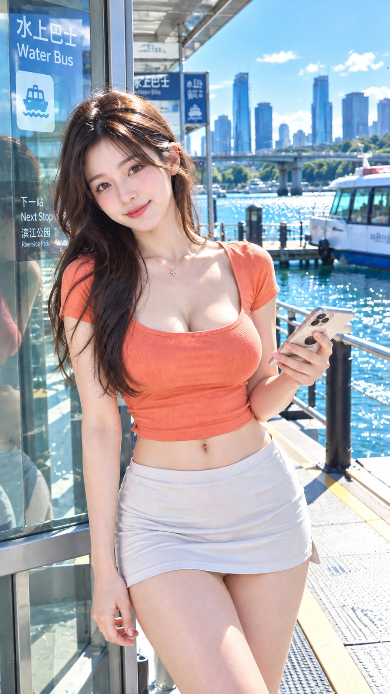

# Daylight CCD Waterfront Commute Lifestyle Photo

**中文标题：** 日间高光CCD滨水通勤：结构化中文生活照  
**ID:** `gi25-x-486` · **Mode:** `generate`  
**Categories:** `character-consistency`, `general`  
**Tags:** `x-twitter`, `community`, `gpt-image-2.5`, `xianyu`, `zh`



### Daylight CCD Waterfront Commute Lifestyle Photo

```text
摄影风格：日间清亮高光CCD生活照风
写真方向：滨水通勤生活写真
场景方向：城市水上巴士站 / 白色浮动站台 / 玻璃候船亭 / 蓝绿色河面 / 城市桥梁远景
服装方向：珊瑚橘色方领修身短袖上衣 + 浅灰白包臀超短裙
气质标签：明亮、都市、松弛、约会感、精致
五官方向：温柔电影自然脸
身形方向：轻盈纤细
线条强调：强
镜头方向：大腿及上半身
姿态动作：靠近玻璃候船亭站立，一只手拿手机，另一只手自然垂落，视线从河面转向镜头
光线氛围：晴天自然光 + 河面反射光 + 白色站台形成清亮补光
滤镜效果：高亮清晰暖冷平衡CCD色彩 + 干净高光 + 明亮中间调 + 轻颗粒
画幅比例：9:16
补充要求：珊瑚橘鲜亮但不荧光，蓝绿水面负责制造清透感；整体更像都市周末出行，不要旅游宣传照，胸部饱满，胸线明显。
```

- **Recommended model:** `gpt-image-2.5-sunburst`
- **Settings:** _(defaults)_
- **Source:** [community](https://x.com/liyue_ai/status/2100528879521980501) — @liyue_ai (via xianyu110/awesome-gpt-image2.5)
- **License note:** Community X post mirrored in xianyu110/awesome-gpt-image2.5; remix with attribution
- **Notes:** xianyu110 case 2100528879521980501; category=人像角色
- **Preview:** `previews/gi25-x-486.jpg`
