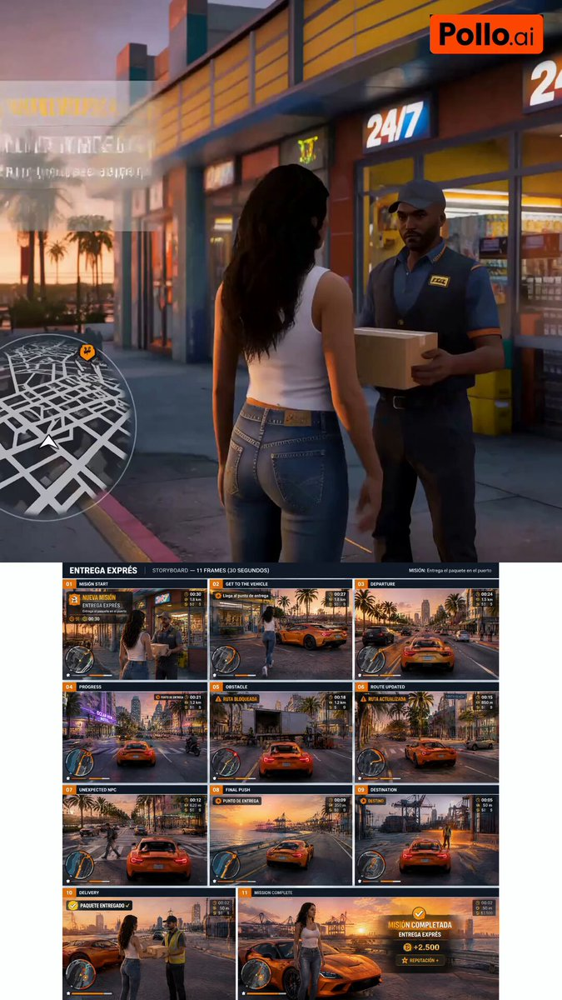

# Image 2.5 Quest Sprite Sheet: 11-Panel Storyboard

**中文标题：** Image2.5任务精灵表：11格分镜→成片管线  
**ID:** `gi25-x-488` · **Mode:** `generate`  
**Categories:** `character-consistency`, `general`  
**Tags:** `x-twitter`, `community`, `gpt-image-2.5`, `xianyu`, `en`



### Image 2.5 Quest Sprite Sheet: 11-Panel Storyboard

```text
Create ONE professional storyboard sheet containing EXACTLY 11 sequential 16:9 frames for a 30-second fictional open-world video game mission.

CORE CONCEPT:
This must look like actual gameplay from a fictional next-generation open-world action game, NOT a cinematic movie trailer.

The player is completing a timed delivery mission in a fictional tropical coastal American city.

MISSION:
“ENTREGA EXPRÉS”
Objective: deliver a package to the port before the timer reaches zero.

The storyboard must clearly communicate:
mission received → travel toward objective → obstacle → route change → unexpected NPC event → progress → arrival → delivery → mission completed → reward.

VISUAL STYLE:
Photorealistic next-generation AAA open-world game graphics.
Tropical coastal city, palm trees, beaches, neon hotels, traffic, pedestrians, downtown skyline, port and ocean.
Late golden hour transitioning naturally into early evening.

ORIGINAL GAME HUD:
Every gameplay frame should use the SAME original interface design.

Include:
- circular minimap in bottom-left corner
- orange GPS route
- destination marker
- subtle health/energy bar
- countdown timer
- distance to objective
- money/points indicator

The HUD must feel polished and believable but MUST NOT copy the interface of any existing video game.

Use orange as the primary accent color for mission markers, GPS route, progress indicators and important HUD elements.

STRICT CONTINUITY:
Same adult female protagonist throughout.
Long dark brown wavy hair, white fitted tank top, blue jeans, white sneakers, gold hoop earrings.

Same bright orange sports car throughout.
Identical design, paint, wheels and interior in every frame.

Same city, weather and continuous sunset lighting.

STORYBOARD FRAMES 01–11:
01 Mission start outside convenience store — receive package, “NUEVA MISIÓN / ENTREGA EXPRÉS”, timer 00:30
02 Run to orange sports car — distance 1.8 km, timer 00:27
03 Departure onto boulevard — distance 1.5 km, timer 00:24
04 Progress through tropical city — distance 1.2 km, timer 00:21
05 Obstacle: delivery truck blocks road — “RUTA BLOQUEADA”, timer 00:18
06 Route updated into side street — “RUTA ACTUALIZADA”, distance 850 m, timer 00:15
07 Unexpected NPC on crosswalk — brake safely, timer 00:12, distance 620 m
08 Final push along coastal road to port — distance 350 m, timer 00:09
09 Destination zone at port — distance 50 m, timer 00:05
10 Delivery to waiting NPC — “PAQUETE ENTREGADO ✓”, timer stops ~00:02
11 Mission complete — “MISIÓN COMPLETADA / +2.500 / REPUTACIÓN +”

CRITICAL:
Timer and distance must decrease logically across frames.
Keep HUD design, typography, placement and scale visually consistent.
Most shots use recognizable third-person gameplay camera, not cinematic trailer angles.
No existing game logos, no GTA UI, no weapons, no collisions, no violence, no watermark.
Exactly 11 storyboard panels, numbered 01–11.

(Pipeline note: feed this sheet to a video model as reference for continuous third-person gameplay; keep HUD/minimap/orange GPS locked.)
```

- **Recommended model:** `gpt-image-2.5-sunburst`
- **Settings:** _(defaults)_
- **Source:** [community](https://x.com/Raul_IA_Prod/status/2100521058331759057) — @Raul_IA_Prod (via xianyu110/awesome-gpt-image2.5)
- **License note:** Community X post mirrored in xianyu110/awesome-gpt-image2.5; remix with attribution
- **Notes:** xianyu110 case 2100521058331759057; category=像素动效
- **Preview:** `previews/gi25-x-488.jpg`
