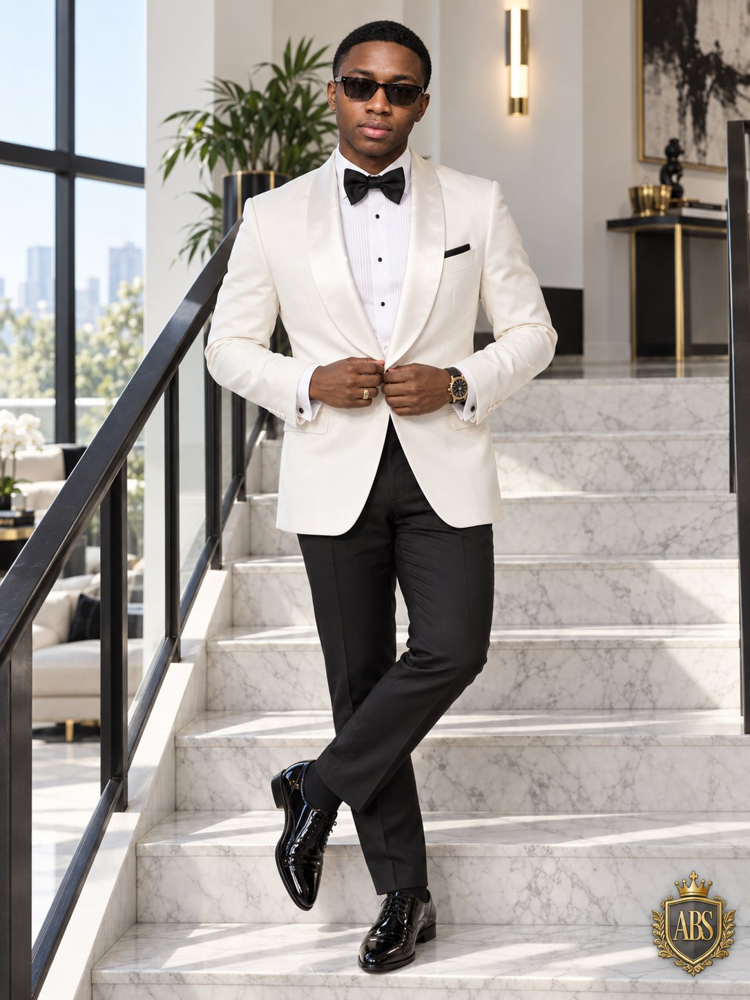

# Wedding Studio + Luxury Crown Badge Pose Lock

**中文标题：** 婚礼棚拍+奢品金冠徽章：上传照锁姿势配方  
**ID:** `gi25-x-492` · **Mode:** `edit`  
**Categories:** `character-consistency`, `edit-change-preserve`  
**Tags:** `x-twitter`, `community`, `gpt-image-2.5`, `xianyu`, `en`



### Wedding Studio + Luxury Crown Badge Pose Lock

```text
Add a small premium gold crown-and-shield monogram emblem in the lower-right corner featuring elegant initials such as “ABS”, designed like a luxury personal-brand crest.

Use the uploaded photo as the visual and pose reference and create a hyper-realistic full-body luxury fashion portrait of an adult man standing confidently on a modern white marble staircase.

Give him a clean low-cut haircut with a sharp natural hairline and make him completely clean-shaven — no beard, no mustache, no facial hair.

Dress him in an elegant white tailored tuxedo jacket with satin lapels, a crisp white pleated dress shirt, a black bow tie, fitted black formal trousers, and polished black leather dress shoes. Add a premium black-and-gold wristwatch and subtle rings. Finish the look with sleek dark rectangular sunglasses.

Recreate the relaxed sophisticated pose: standing midway on the staircase with one leg crossed naturally over the other, both hands lightly adjusting the front of the tuxedo jacket, shoulders relaxed, body facing forward, and a calm confident expression.

Set the scene inside a bright, high-end contemporary home with white marble stairs, black metal railings, tall floor-to-ceiling windows, white walls, a modern wall light, and a green indoor plant in the background. Allow soft natural daylight to enter from the side, creating realistic highlights and gentle shadows across the staircase and clothing.

Keep the composition clean, luxurious, and editorial with realistic skin texture, accurate body proportions, crisp fabric details, natural reflections on the shoes and sunglasses, professional fashion photography, shallow background separation, premium DSLR quality, ultra-detailed, photorealistic, 3:4 vertical aspect ratio.
```

- **Recommended model:** `gpt-image-2.5-sunburst`
- **Settings:** _(defaults)_
- **Source:** [community](https://x.com/abs_uiux/status/2100497484472836181) — @abs_uiux (via xianyu110/awesome-gpt-image2.5)
- **License note:** Community X post mirrored in xianyu110/awesome-gpt-image2.5; remix with attribution
- **Notes:** xianyu110 case 2100497484472836181; category=人像角色
- **Preview:** `previews/gi25-x-492.jpg`
