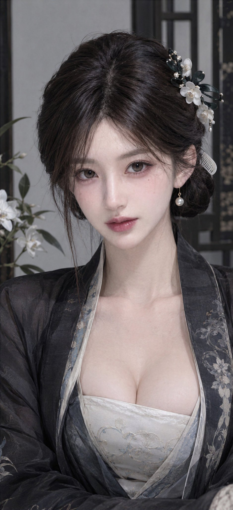

# Cool Classical Beauty Close-Up 「幽兰花影」

**中文标题：** 清冷古风美妆特写：幽兰花影中文结构化配方  
**ID:** `gi25-x-496` · **Mode:** `generate`  
**Categories:** `character-consistency`, `general`  
**Tags:** `x-twitter`, `community`, `gpt-image-2.5`, `xianyu`, `zh`



### Cool Classical Beauty Close-Up 「幽兰花影」

```text
主题风格： 古风极简高级美妆特写
身份气质： 名门小姐，端庄、理性、清贵、教养感强
妆感目标： 素墨兰庭雅致妆
五官方向： 高级耐看脸，五官比例端正，修长杏眼，面中饱满，鼻型清秀，唇形克制丰润
发型与发饰方向： 乌发整洁低盘，墨玉兰花簪、白色贝母小梳、单颗珍珠耳饰
服装方向： 素黑青窄袖上襦，搭配骨白色长裙与兰灰色云肩
场景方向： 极简兰庭 / 黑木屏风 / 白墙 / 一枝兰花
镜头方向： 美妆特写，正面端坐，眼神平静直视镜头
画幅比例： 9:16
创意自由度： 保守
补充要求： 眼妆使用墨茶棕、灰粉和极少珠光，腮红位置克制，唇色为冷玫瑰豆沙；妆后呈现端庄、理性、极有教养的贵女感。胸部饱满自然，胸线明显，画面元素尽量少，靠五官、妆容和气质撑住画面。
```

- **Recommended model:** `gpt-image-2.5-sunburst`
- **Settings:** _(defaults)_
- **Source:** [community](https://x.com/AndyLau42/status/2100478461395538422) — @AndyLau42 (via xianyu110/awesome-gpt-image2.5)
- **License note:** Community X post mirrored in xianyu110/awesome-gpt-image2.5; remix with attribution
- **Notes:** xianyu110 case 2100478461395538422; category=人像角色
- **Preview:** `previews/gi25-x-496.jpg`
