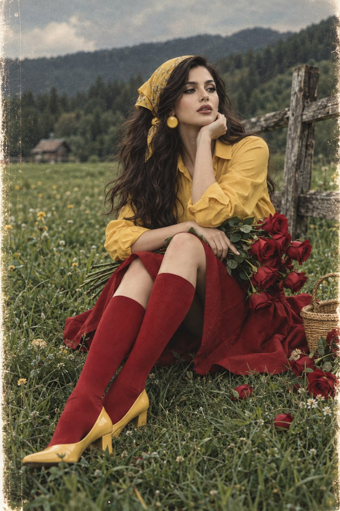

# Vintage Film Fashion: Running Silhouette in Wheatfield

**中文标题：** 复古胶片时尚：麦田奔跑侧影完整 prompt  
**ID:** `gi25-x-497` · **Mode:** `generate`  
**Categories:** `character-consistency`, `general`  
**Tags:** `x-twitter`, `community`, `gpt-image-2.5`, `xianyu`, `en`



### Vintage Film Fashion: Running Silhouette in Wheatfield

```text
Create a cinematic, photorealistic fashion photograph of a young Asian woman captured in elegant side profile as she runs through a wide, lush green meadow, carrying a beautiful bouquet of long-stemmed red roses. Her outfit combines vintage charm with bold retro styling: a vibrant mustard-yellow button-down shirt with long sleeves, a deep crimson knee-length A-line skirt, matching red knee-high socks, and yellow round-toe pumps with a modest heel. A yellow vintage bandana is tied over her long, flowing dark wavy hair, complemented by striking oversized circular yellow earrings.
The scene evokes the nostalgic look of 1980s–1990s analog film photography, featuring deep green tones, vivid red and yellow color contrasts, soft diffused daylight, and a subtly moody outdoor atmosphere. Capture her natural movement, flowing hair, and the gentle motion of the roses with an artistic editorial composition. Add authentic fine-grain film texture, soft tonal transitions, slightly muted highlights, and a timeless vintage aesthetic. High detail, realistic skin texture, natural motion, cinematic framing, and professional fashion photography.
```

- **Recommended model:** `gpt-image-2.5-sunburst`
- **Settings:** _(defaults)_
- **Source:** [community](https://x.com/mehvishs25/status/2100474309764640921) — @mehvishs25 (via xianyu110/awesome-gpt-image2.5)
- **License note:** Community X post mirrored in xianyu110/awesome-gpt-image2.5; remix with attribution
- **Notes:** xianyu110 case 2100474309764640921; category=人像角色
- **Preview:** `previews/gi25-x-497.jpg`
