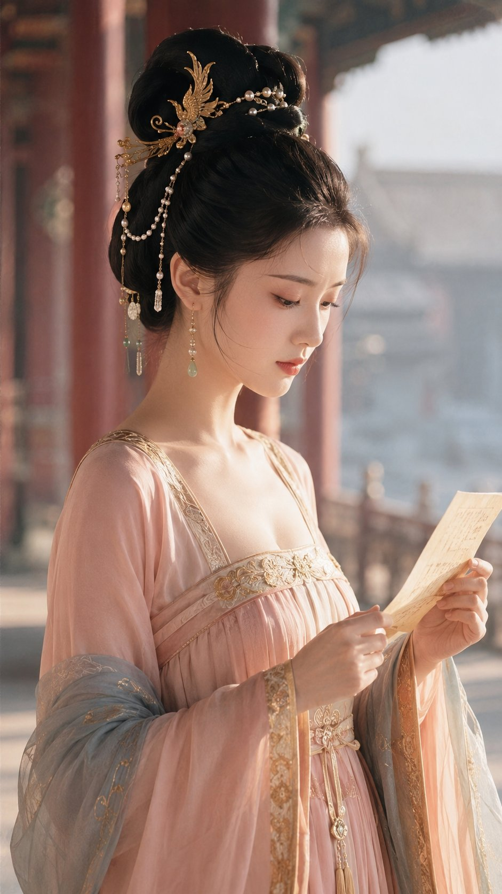

# Tang Palace Corridor Letter-Reading Half-Body 9:16

**中文标题：** 唐风宫廊读信：9:16 半身近景配方  
**ID:** `gi25-x-503` · **Mode:** `generate`  
**Categories:** `character-consistency`, `general`  
**Tags:** `x-twitter`, `community`, `gpt-image-2.5`, `xianyu`, `zh`



### Tang Palace Corridor Letter-Reading Half-Body 9:16

```text
9:16 竖版唐风美学国风 CG 人像，超写实与东方诗意融合，半身近景特写。一位明确成年的东亚古典美人立于清晨宫廊，身体为右侧面，头部随身体朝向前方，目光落在手中展开的薄绢书信上。她拥有冷白通透肌肤、细长凤眼和自然柔和的立体五官，眉间略微收紧，胭脂唇轻抿，表情从羞涩转为若有所思，情绪安静而明确。她穿浅杏粉高腰唐风襦裙与冷青灰披帛，鎏金纹样只点缀领缘和袖口，适度低领衬托修长颈线；头饰由轻巧金凤发簪、珍珠串和一枚青玉组成，保留唐风华贵感但更简洁。双手共同展开书信，手指结构自然，袖纱形成柔性引导线。背景虚化为朱红廊柱、青灰晨雾和微亮庭院，金色晨光从侧前方照亮脸颊，冷白天光填充暗部，发丝边缘清晰。85mm，f/1.8，浅景深，低饱和杏粉、金色和青灰体系，真实丝绢材质、轻颗粒与柔光。
```

- **Recommended model:** `gpt-image-2.5-sunburst`
- **Settings:** _(defaults)_
- **Source:** [community](https://x.com/Mrpinecone888/status/2100205250825380199) — @Mrpinecone888 (via xianyu110/awesome-gpt-image2.5)
- **License note:** Community X post mirrored in xianyu110/awesome-gpt-image2.5; remix with attribution
- **Notes:** xianyu110 case 2100205250825380199; category=人像角色
- **Preview:** `previews/gi25-x-503.jpg`
