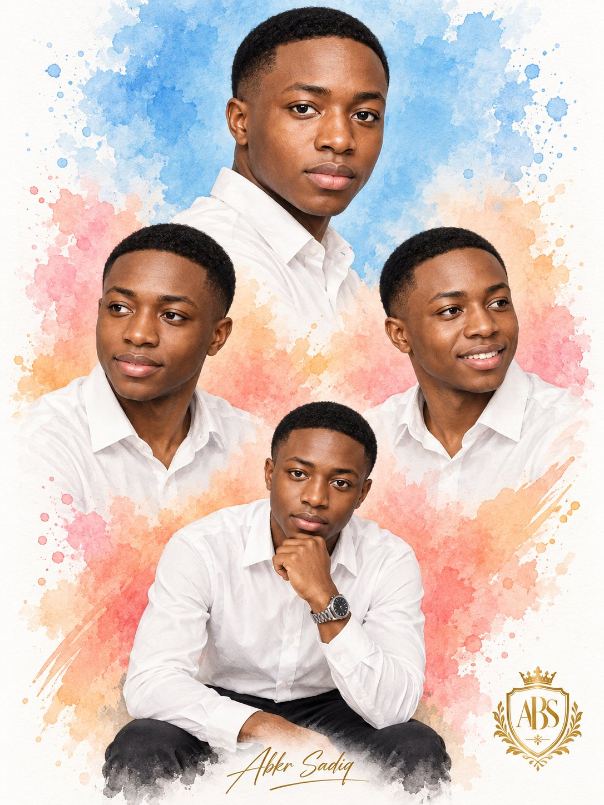

# One Face, Four Poses Watercolor Collage Lock

**中文标题：** 一图四 pose 水彩拼贴：人脸锁完整 prompt  
**ID:** `gi25-x-508` · **Mode:** `edit`  
**Categories:** `character-consistency`, `edit-change-preserve`  
**Tags:** `x-twitter`, `community`, `gpt-image-2.5`, `xianyu`, `en`



### One Face, Four Poses Watercolor Collage Lock

```text
Use the uploaded photo as the facial identity reference and create a premium four-pose watercolor portrait collage of the same adult man. Preserve his recognizable facial structure, skin tone, features, and natural proportions accurately.

Give him a neat low-cut haircut with a clean natural hairline and subtle taper fade, professionally groomed. Keep him clean-shaven with no beard or mustache.

Dress him consistently in a crisp white long-sleeve button-up shirt with black trousers. Arrange four portraits in one vertical composition:

Top: large shoulder-up three-quarter portrait, body turned slightly away while looking confidently toward the camera.

Middle left: chest-up portrait with a relaxed smile, looking slightly to the side.

Middle right: chest-up portrait smiling naturally while looking in the opposite direction.

Bottom: seated portrait, leaning slightly forward with one hand resting beneath the chin, wearing a simple silver wristwatch.

Blend the portraits smoothly using a soft watercolor splash background with sky blue at the top transitioning into coral orange, blush pink, and subtle peach tones toward the bottom. Add organic paint splashes, soft feathered edges, delicate pigment textures, and plenty of clean white negative space.

Style: high-end watercolor editorial portrait, realistic facial details combined with hand-painted watercolor textures, elegant celebrity-style collage, clean premium poster design, soft natural lighting, sharp eyes, realistic skin texture, balanced composition, high detail.

Add a small elegant handwritten signature-style text “Abkr Sadiq” near the bottom center.

Aspect ratio: 3:4 portrait.
```

- **Recommended model:** `gpt-image-2.5-sunburst`
- **Settings:** _(defaults)_
- **Source:** [community](https://x.com/abs_uiux/status/2100164037896225226) — @abs_uiux (via xianyu110/awesome-gpt-image2.5)
- **License note:** Community X post mirrored in xianyu110/awesome-gpt-image2.5; remix with attribution
- **Notes:** xianyu110 case 2100164037896225226; category=人像角色
- **Preview:** `previews/gi25-x-508.jpg`
