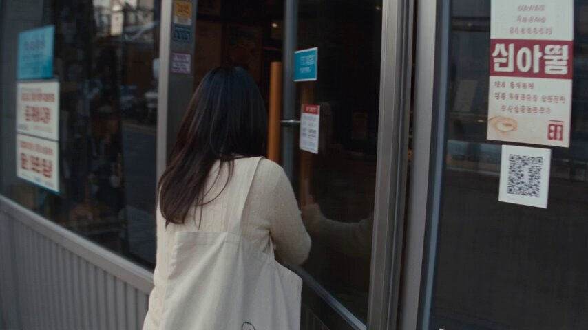

# Seoul Café Identity-Lock UGC (Image 2.5→Video)

**中文标题：** 首尔咖啡馆身份锁 UGC：Image 2.5→视频  
**ID:** `gi25-x-512` · **Mode:** `generate`  
**Categories:** `character-consistency`, `general`  
**Tags:** `x-twitter`, `community`, `gpt-image-2.5`, `xianyu`, `en`



### Seoul Café Identity-Lock UGC (Image 2.5→Video)

```text
Create a 30-second ultra-realistic personal home-video of a young Korean woman visiting a small indie café in an older Seoul neighborhood on a quiet afternoon. Use the attached image as the character reference and keep her face, hairstyle, and outfit consistent throughout.
She walks into a cozy, small café, orders at the counter, and waits briefly before receiving her coffee. She finds a seat by the window, pulls out a book from her tote bag, and settles in, sipping her coffee occasionally while reading. She pauses to look out the window for a moment, watching the street outside, then goes back to her book, turning a page and adjusting her position in the chair.
Use raw early-2000s consumer DV-camera footage: handheld shake, imperfect framing, autofocus hunting, exposure shifts from window light, soft detail, mild noise, natural motion blur and occasional awkward zooms.
Natural café ambience only — quiet murmur of other customers, cups clinking, page turns, faint street sounds through the window. No music, no narration, no dramatic events, no polished commercial cinematography.
```

- **Recommended model:** `gpt-image-2.5-sunburst`
- **Settings:** _(defaults)_
- **Source:** [community](https://x.com/MahnoorAi12/status/2100109930921419055) — @MahnoorAi12 (via xianyu110/awesome-gpt-image2.5)
- **License note:** Community X post mirrored in xianyu110/awesome-gpt-image2.5; remix with attribution
- **Notes:** xianyu110 case 2100109930921419055; category=人像角色
- **Preview:** `previews/gi25-x-512.jpg`
