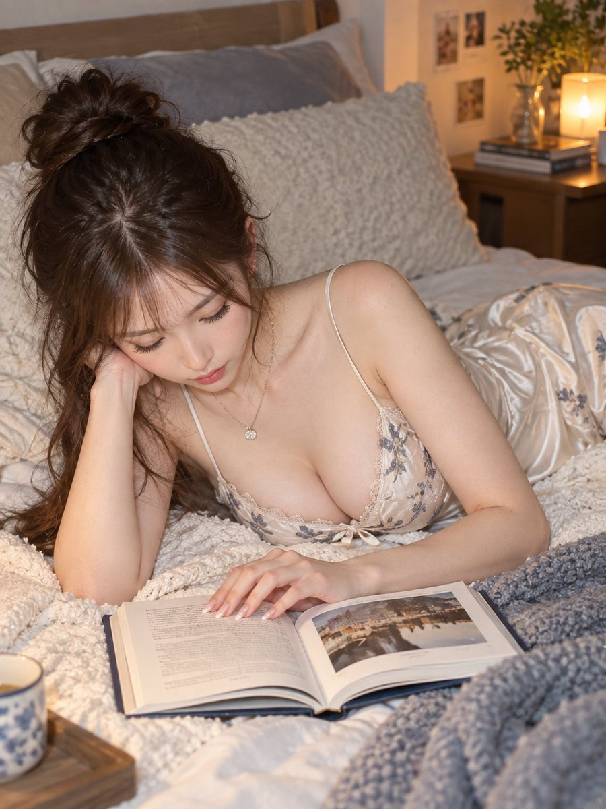

# A Photorealistic Portrait Prompt Of A Young Woman Lying On A Bed Reading A Bo…

**中文标题：** 主題：  
**ID:** `gi25-x-516` · **Mode:** `generate`  
**Categories:** `character-consistency`, `general`  
**Tags:** `x-twitter`, `community`, `gpt-image-2.5`, `leadde`, `ja`



### A Photorealistic Portrait Prompt Of A Young Woman Lying On A Bed Reading A Bo…

```text
主題：
読書灯の青刺繍

主体：
画面中央、暖かな寝室の白いベッドへうつ伏せで本を読む若い女性。白地に青い花刺繍のサテンキャミソール、開いた本、左奥のマグが主役。

人物・表情：
小さな卵形の顔、伏せた濃茶の瞳、細い眉、整った鼻、淡桃色の閉じた唇。顔を下へ向け、視線を本へ落とした穏やかな表情。濃茶の髪は頭頂で編みお団子、薄い前髪と長い髪を左肩へ流す。

服装・ポーズ：
白い艶サテンの細肩紐キャミソールドレスは胸に青灰の花刺繍、白レース縁、中央リボン。ベッドへうつ伏せに寝て左肘で頬を支え、右腕を本へ伸ばし、右指先でページに触れる。

背景・光：
前景中央に開いた写真入りの本、左下に青花柄のマグ、画面右に青灰の編み毛布、背景に白い枕、写真、植物、暖色ランプ。右後方のランプが柔らかく顔と寝具を照らす。

構図・カメラ：
3:4の縦構図、ベッド面より少し高い斜め正面カメラで頭頂から本と胸下までを収める上半身ポートレート。人物を中央上へ大きく、本を下半分へ配置。腕は端で裁切し、顔と本にピント、背景は柔らかくぼかす。

質感・スタイル：
フォトリアルな実写写真。自然な肌、艶サテン、花刺繍、紙、編み毛布、暖かな灯りを高精細にし、白、青灰、琥珀色の夜景。

ネガティブ：
読書とうつ伏せ変更；青刺繍サテン省略
```

- **Recommended model:** `gpt-image-2.5-sunburst`
- **Settings:** _(defaults)_
- **Source:** [community](https://x.com/CyberTotal2026/status/2102659732154487254) — @CyberTotal2026 (via LeaddeOpenLab/awesome-gpt-image-2-5-prompts)
- **License note:** Community X post mirrored in LeaddeOpenLab/awesome-gpt-image-2-5-prompts; remix with attribution
- **Notes:** LeaddeOpenLab library 2102659732154487254
- **Preview:** `previews/gi25-x-516.jpg`
