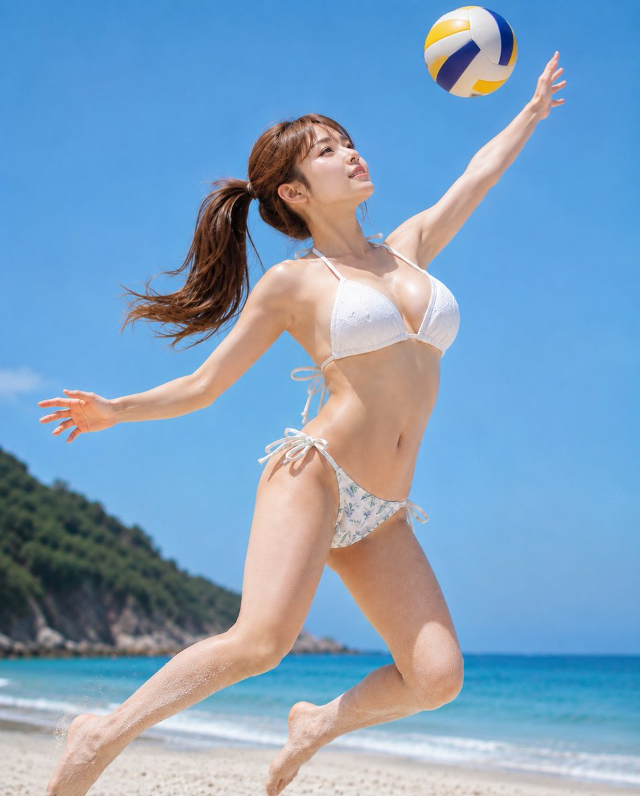

# A Woman In Swimwear Jumping For A Volleyball…

**中文标题：** 主題：  
**ID:** `gi25-x-517` · **Mode:** `generate`  
**Categories:** `character-consistency`, `general`  
**Tags:** `x-twitter`, `community`, `gpt-image-2.5`, `leadde`, `ja`



### A Woman In Swimwear Jumping For A Volleyball…

```text
主題：
真昼の白いスパイク

主体：
画面中央、青空のビーチでバレーボールへ跳び上がる若い女性の全身。白いビキニ、花柄ボトム、高いポニーテール、右上の黄青白ボールが主役。

人物・表情：
細い卵形の横顔、濃茶の瞳、細い眉、整った鼻、淡桃色に開いた唇。顔と視線を右上のボールへ向けた集中した表情。濃茶の長い髪は高いポニーテールで左へなびき、薄い前髪と後れ毛。

服装・ポーズ：
白いレース調の三角ホルター水着トップは首と背中を細紐結び。白地に淡青緑の小花柄ショーツは左右を白い蝶結び。砂浜から両脚を曲げて高く跳び、右腕をボールへ伸ばし、左腕を横へ開く。

背景・光：
背景上半分は濃い青空、左下に緑の岬、下部にターコイズの海、白波、砂浜。上方の硬い直射日光が顔、胸、腹、脚を強く照らし、砂粒と肌に明瞭な光沢を作る。

構図・カメラ：
4:5の縦構図、低い仰角カメラで頭上のボールから伸ばした足先まで全身を収める。跳ぶ人物を中央へ大きく、ボールを右上、岬を左下へ配置。四肢を画面内に収め、人物とボールにピント、海は軽くぼかす。

質感・スタイル：
フォトリアルな実写写真。濡れた肌、白い水着、小花柄、風になびく髪、砂粒、海面を高精細にし、青、白、黄の鮮烈な真昼色。

ネガティブ：
跳躍とボール位置変更；白水着や花柄省略
```

- **Recommended model:** `gpt-image-2.5-sunburst`
- **Settings:** _(defaults)_
- **Source:** [community](https://x.com/CyberTotal2026/status/2102627519790723184) — @CyberTotal2026 (via LeaddeOpenLab/awesome-gpt-image-2-5-prompts)
- **License note:** Community X post mirrored in LeaddeOpenLab/awesome-gpt-image-2-5-prompts; remix with attribution
- **Notes:** LeaddeOpenLab library 2102627519790723184
- **Preview:** `previews/gi25-x-517.jpg`
