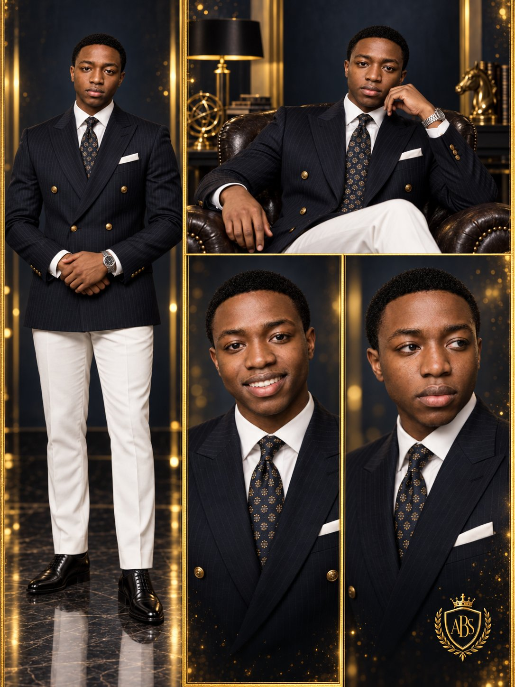

# Personal-Brand Studio Quad: Four Expressions, One Identity

**中文标题：** 个人品牌四联棚拍：一图四种表情身份锁  
**ID:** `gi25-x-529` · **Mode:** `edit`  
**Categories:** `character-consistency`, `general`, `edit-change-preserve`  
**Tags:** `x-twitter`, `community`, `gpt-image-2.5`, `xianyu`, `en`



### Personal-Brand Studio Quad: Four Expressions, One Identity

```text
Add a small premium gold crown-and-shield monogram emblem in the lower-right corner featuring elegant initials such as “ABS”, designed like a luxury personal-brand crest.

Use the uploaded photo as the facial identity reference and create a premium cinematic studio portrait of the same adult man. Preserve his recognizable facial structure, skin tone, features, and proportions accurately.

Create a premium cinematic multi-panel fashion portrait of the same adult man, presented as four coordinated portraits inside one vertical composition.

Use a luxurious deep navy-to-black studio background with subtle golden vertical frame lines separating each portrait. Add faint warm gold particles and soft highlights for an elegant editorial atmosphere.

Main center portrait: Show the man full-body, standing confidently and smiling slightly. Dress him in a tailored dark navy double-breasted blazer with subtle pinstripes and gold buttons, crisp white dress shirt, patterned dark tie, white pocket square, slim white tailored trousers, and polished black leather dress shoes. Add a sophisticated silver wristwatch. His hands are gently clasped together around waist level.

Top portrait: Place him seated confidently in a dark leather armchair, wearing the same navy blazer, white shirt, patterned tie, pocket square, and light trousers. One hand rests naturally on the chair arm. Give him a relaxed, composed expression.

Left portrait: Create a chest-up close-up of him laughing naturally with a wide genuine smile, showing an energetic and approachable personality.

Right portrait: Create another chest-up close-up with a serious, intense expression, looking slightly to the side for a strong executive/editorial feel.

Keep the same facial identity, hairstyle, facial proportions, skin tone, clothing details, and overall appearance consistent across all four portraits.

Use cinematic studio lighting with soft highlights on the face and suit, controlled shadows, subtle rim lighting, realistic skin texture, sharp tailoring details, luxury menswear campaign styling, high-end magazine photography, symmetrical composition, dramatic contrast, ultra-realistic finish, 85mm portrait lens look, shallow depth of field, premium color grading, high detail, vertical 9:16 aspect ratio.
```

- **Recommended model:** `gpt-image-2.5-sunburst`
- **Settings:** _(defaults)_
- **Source:** [community](https://x.com/abs_uiux/status/2099973325779054806) — @abs_uiux (via xianyu110/awesome-gpt-image2.5)
- **License note:** Community X post mirrored in xianyu110/awesome-gpt-image2.5; remix with attribution
- **Notes:** xianyu110 case 2099973325779054806; category=人像角色; verified=True
- **Preview:** `previews/gi25-x-529.jpg`
