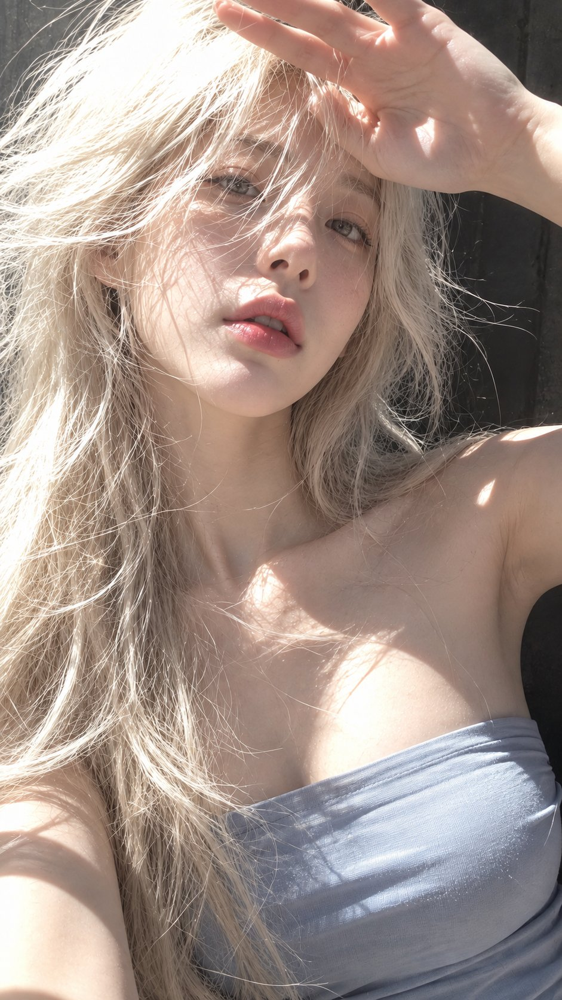

# Harsh-Sun Portrait in Four Hair Colors: One Sunlight Recipe

**中文标题：** 烈日人像四发色：同一阳光感配方  
**ID:** `gi25-x-530` · **Mode:** `generate`  
**Categories:** `character-consistency`, `general`  
**Tags:** `x-twitter`, `community`, `gpt-image-2.5`, `xianyu`, `en`



### Harsh-Sun Portrait in Four Hair Colors: One Sunlight Recipe

```text
Hair color: 
Top: 
Sunlight: 
Pose: 
Background: 

Create a 9:16 ultra-realistic close-up portrait of an adult young woman in strong natural sunlight.

Make the sunlight a major part of the image: direct, uneven, slightly harsh, with bright highlights falling across the hair, face, shoulders, and collarbone. Allow small areas of controlled highlight clipping while keeping facial structure and skin detail visible.

Hair should feel especially alive in the light—natural volume, loose strands, flyaways, fine individual hairs, and subtle movement. Backlit or side-lit strands should glow clearly against the darker background, with realistic variation in tone rather than a flat solid hair color.

Keep the skin highly realistic and human: visible fine texture, subtle pores, natural tonal variation, soft facial color, and believable highlights. Avoid overly smooth, oily, plastic, waxy, or CGI-looking skin.

Use a simple fitted top with a clean neckline and realistic fabric texture. The clothing should gently define and complement the upper-body silhouette without becoming the main focus. Keep the design minimal, with no logos, prints, or distracting accessories.

Frame the portrait very close, with slightly imperfect cropping and a casual, private snapshot feeling. Let a few strands of hair cross the face naturally. Keep the expression relaxed and understated, never like a commercial fashion pose.

Use a simple darker background to make the sunlit hair and skin stand out.

Overall feel: intimate, sun-drenched, candid, tactile, slightly imperfect, and genuinely photographic rather than polished studio beauty photography.

Avoid: beauty-filter skin, perfect salon hair, flat soft lighting, studio lighting, excessive retouching, glossy CGI skin, fake wig texture, overly posed expressions, busy backgrounds, distorted hands, or unnatural anatomy.
```

- **Recommended model:** `gpt-image-2.5-sunburst`
- **Settings:** _(defaults)_
- **Source:** [community](https://x.com/MrLarus/status/2099904698073616580) — @MrLarus (via xianyu110/awesome-gpt-image2.5)
- **License note:** Community X post mirrored in xianyu110/awesome-gpt-image2.5; remix with attribution
- **Notes:** xianyu110 case 2099904698073616580; category=人像角色; verified=True
- **Preview:** `previews/gi25-x-530.jpg`
