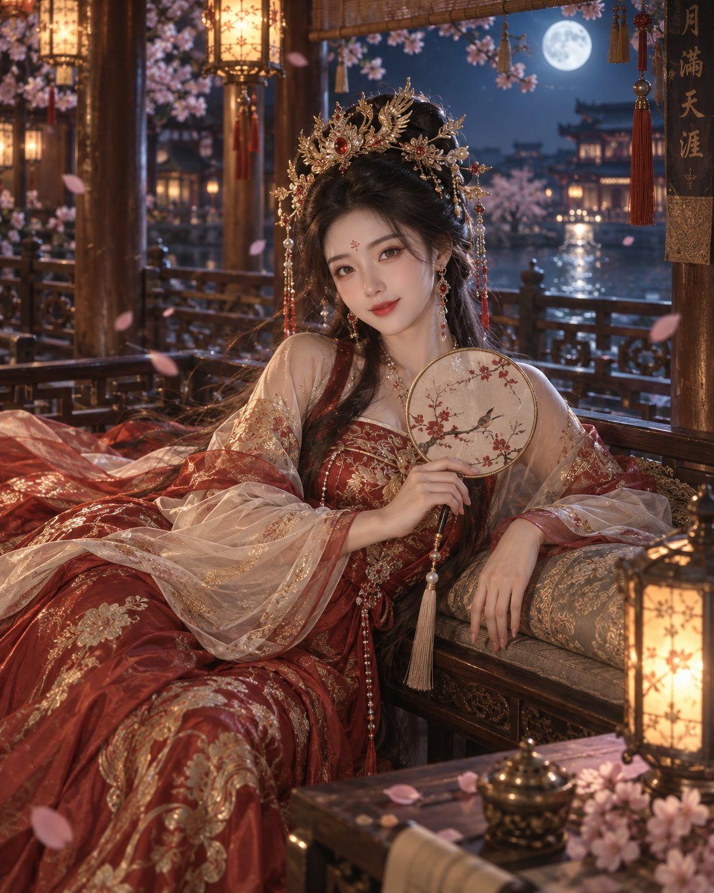

# Han-Style Night Pavilion Portrait: Warm Lantern Gold x Cool Moonlight Blue

**中文标题：** 汉风夜亭人像：宫灯暖金×月光冷蓝  
**ID:** `gi25-x-533` · **Mode:** `generate`  
**Categories:** `character-consistency`, `general`  
**Tags:** `x-twitter`, `community`, `gpt-image-2.5`, `xianyu`, `zh`



### Han-Style Night Pavilion Portrait: Warm Lantern Gold x Cool Moonlight Blue

```text
一位明确成年的明艳古风女子斜倚在夜色木亭的软榻边，身穿胭脂红与鎏金配色的华丽汉服，外搭米白薄纱长袖，头戴金凤凰红宝石珍珠凤冠。她的身体朝向右前方，头部轻轻偏向左侧，目光直视镜头，眉眼温柔坚定，嘴角微扬；一只手握着圆形团扇置于胸前，另一只手轻搭软榻边缘。晚风推动披帛、长发和凤冠流苏，几片樱花从暖色宫灯前掠过。背景保留木柱、雕花栏杆和虚化月色，宫灯暖金光照亮脸部与红色织锦，冷蓝月光勾勒肩线和发丝。85mm 人像镜头，f/1.8 浅景深，克制冷暖对比，东方电影美学、高级华丽而不艳俗、8K。
```

- **Recommended model:** `gpt-image-2.5-sunburst`
- **Settings:** _(defaults)_
- **Source:** [community](https://x.com/Mrpinecone888/status/2099845483594404165) — @Mrpinecone888 (via xianyu110/awesome-gpt-image2.5)
- **License note:** Community X post mirrored in xianyu110/awesome-gpt-image2.5; remix with attribution
- **Notes:** xianyu110 case 2099845483594404165; category=人像角色; verified=True
- **Preview:** `previews/gi25-x-533.jpg`
