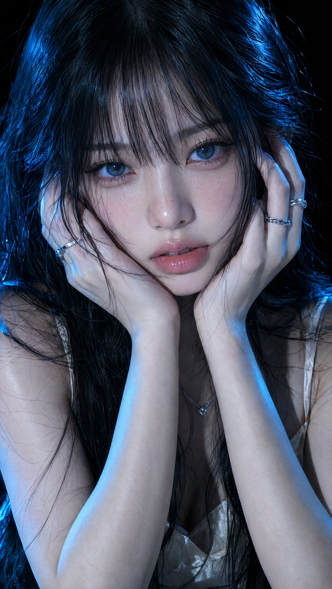

# Flare 9:16 4K Max: East Asian Porcelain-Skin Close-Up Portrait

**中文标题：** Flare 9:16 4K Max：东亚瓷肤近景人像  
**ID:** `gi25-x-536` · **Mode:** `generate`  
**Categories:** `character-consistency`, `general`  
**Tags:** `x-twitter`, `community`, `gpt-image-2.5`, `xianyu`, `en`



### Flare 9:16 4K Max: East Asian Porcelain-Skin Close-Up Portrait

```text
A ultra-realistic close-up portrait of a young East Asian woman with fair, porcelain skin and a soft, dewy complexion. She has long, messy black hair with straight bangs falling over her forehead and strands framing her face, some strands appearing slightly wet or glossy. Large, striking blue eyes with long lashes look directly at the viewer with an intense, slightly melancholic expression. Soft pink glossy lips slightly parted.

Both hands gently cup her face, fingers resting on her cheeks and temples, showing multiple delicate silver rings on her fingers (twisted and band styles). She wears a thin silver chain necklace and a matching delicate bracelet.

She is wearing a light cream or off-white spaghetti-strap top with a soft, silky texture. Dramatic cinematic cyan-blue lighting from both sides creates strong highlights on her skin, hair, and jewelry while casting deep shadows across her face and against a pure black background. High-detail skin texture, subtle freckles, sharp focus on the eyes, photorealistic quality, soft volumetric light rays, 8k resolution, beauty photography style.
```

- **Recommended model:** `gpt-image-2.5-flare`
- **Settings:** _(defaults)_
- **Source:** [community](https://x.com/woleswoosh/status/2099743767951737090) — @woleswoosh (via xianyu110/awesome-gpt-image2.5)
- **License note:** Community X post mirrored in xianyu110/awesome-gpt-image2.5; remix with attribution
- **Notes:** xianyu110 case 2099743767951737090; category=人像角色; verified=True
- **Preview:** `previews/gi25-x-536.jpg`
