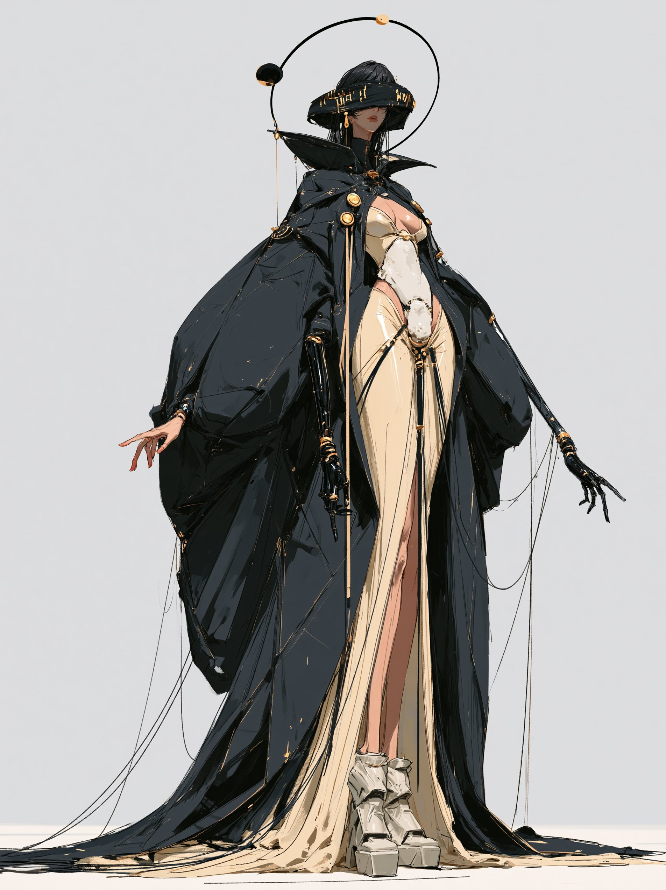

# Fashion Character Concept Sheet: 16:9 Style-Locked Reference

**中文标题：** 时尚角色设定表：16:9 锁风格参考成片  
**ID:** `gi25-x-540` · **Mode:** `edit`  
**Categories:** `character-consistency`, `general`, `edit-change-preserve`  
**Tags:** `x-twitter`, `community`, `gpt-image-2.5`, `xianyu`, `en`



### Fashion Character Concept Sheet: 16:9 Style-Locked Reference

```text
Create a premium modern high-fashion CHARACTER CONCEPT ART SHEET in a 16:9 widescreen layout on a pure white background. THE ATTACHED REFERENCE IMAGE DEFINES THE ART STYLE.

[STYLE — MIRROR THE REFERENCE EXACTLY]: Replicate reference image verbatim: painterly matte digital gouache, flat posterized color blocks, NO outlines, hard-edged brush shapes, identical muted palette and bright white background.

[STYLE PROHIBITIONS — ABSOLUTE]: no outlines, no ink lines, no cel-shading, no 3D render, no glossy highlights, no photorealism, no petite proportions.

[PROPORTIONS]: Match reference exactly: 10 heads tall, elongated fashion anatomy, long slender limbs, small head.

[SUBJECT_DESCRIPTION]: Extremely tall adult woman in early 20s, wide black visor-hat with gold script, floating orbital halo, black prosthetic arms with trailing puppet strings. Outfit: massive ballooning obsidian cloak with gold buttons, structured cream draped gown with high slit, chunky platform heels. Ability: Controls invisible gravitational tethers to manipulate reality and celestial fragments.

Layout Composition:

1. LEFT PANEL: METADATA & TURNAROUND — Name "OPHELIA", metadata block ("ROLE: Graviton Oracle", "CORE MOOD: Detached Supremacy", "VISUAL SIGNATURE: Orbital Halo & Gravity Strings"), 3 turnaround figures, 3 silhouettes, 4 expression crops (obscured visor glare, slight chin lift, gold glyphs glowing, cold smirk).
2. CENTRAL PANEL: Dominant full-body centerpiece in towering signature pose with trailing strings and floating halo.
3. RIGHT PANEL: 4 dynamic pose studies (pulling gravity threads, levitating above ground, cloak billowing wide, adjusting hat) with handwritten labels.
4. BOTTOM RIGHT PANEL: 5 square detail crops (visor gold glyphs, orbital halo sphere, black prosthetic hand/strings, gown drape, platform heels).
```

- **Recommended model:** `gpt-image-2.5-sunburst`
- **Settings:** _(defaults)_
- **Source:** [community](https://x.com/itsPixieVerse/status/2099712708908319052) — @itsPixieVerse (via xianyu110/awesome-gpt-image2.5)
- **License note:** Community X post mirrored in xianyu110/awesome-gpt-image2.5; remix with attribution
- **Notes:** xianyu110 case 2099712708908319052; category=人像角色; verified=True
- **Preview:** `previews/gi25-x-540.jpg`
