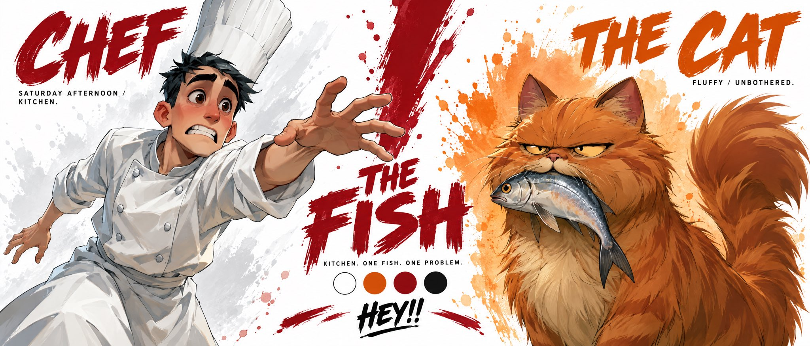

# Chef & Cat Duo Character Bible Sheet (Strict Reference Lock)

**中文标题：** Chef & Cat 双人角色圣经表（严格 ref 锁脸）  
**ID:** `gi25-x-547` · **Mode:** `edit`  
**Categories:** `character-consistency`, `general`, `edit-change-preserve`  
**Tags:** `x-twitter`, `community`, `gpt-image-2.5`, `xianyu`, `en`



### Chef & Cat Duo Character Bible Sheet (Strict Reference Lock)

```text
Create a premium cinematic character bible sheet for THE CHEF & THE CAT. Use uploaded character sheets as strict visual reference for both characters. Do not change either's appearance.

LAYOUT: Split screen partner format. Two halves divided by a bold dramatic dividing element in the center.

LEFT SIDE — CHEF: Clean white watercolor splash behind him fading into center. Large bold brushstroke text CHEF top left in deep red. Below small text: SATURDAY AFTERNOON / KITCHEN. One massive dramatic cropped hero image of the chef from mid-thigh up — desperate exhausted expression, white chef uniform, tall white hat slightly crooked, one arm outstretched reaching for something he can't catch, white watercolor splash radiating behind him.

CENTER: Bold dramatic THE FISH in deep red, slightly worn. Below it small text: KITCHEN. ONE FISH. ONE PROBLEM.

RIGHT SIDE — CAT: Warm orange watercolor splash behind him fading into center. Large bold brushstroke text THE CAT top right in deep orange. Below small text: FLUFFY / UNBOTHERED. One massive dramatic cropped hero image of the cat from mid-body up — narrow judgemental eyes, smug expression, large fish dangling from its mouth, arrogant tail curled upward, orange watercolor splash radiating behind him.

BOTTOM CENTER: Color palette — clean white, warm orange, deep red, black. Tagline centered: HEY!!

OVERALL: Clean white background, white watercolor left side, warm orange watercolor right side, dramatic deep red center divider, bold flat color blocking, chunky simplified forms, hard edge shadows, thick black outlines, vibrant saturated colors, minimal clean typography, cinematic cel-shaded 3D anime, hand-painted textures, not cartoon not Disney not Pixar, print ready.
```

- **Recommended model:** `gpt-image-2.5-sunburst`
- **Settings:** _(defaults)_
- **Source:** [community](https://x.com/TechieBySA/status/2099460145449185433) — @TechieBySA (via xianyu110/awesome-gpt-image2.5)
- **License note:** Community X post mirrored in xianyu110/awesome-gpt-image2.5; remix with attribution
- **Notes:** xianyu110 case 2099460145449185433; category=人像角色; verified=True
- **Preview:** `previews/gi25-x-547.jpg`
