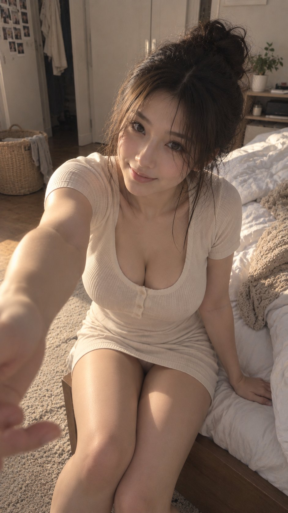

# Realistic Lifestyle Photo Recipe: Reaching Out to Pull You Out of Bed (9:16)

**中文标题：** 写实生活照配方：伸手拉你起床的 9:16  
**ID:** `gi25-x-563` · **Mode:** `generate`  
**Categories:** `character-consistency`, `general`  
**Tags:** `x-twitter`, `community`, `gpt-image-2.5`, `xianyu`, `zh`



### Realistic Lifestyle Photo Recipe: Reaching Out to Pull You Out of Bed (9:16)

```text
风格方向： 周末赖床后的亲密互动
场景方向： 卧室床边 / 地毯旁
服装方向： 奶油白修身短袖家居裙
气质标签： 亲近、慵懒、温柔、轻甜、自然
身形方向： 丰腴自然曲线
线条强调： 中偏强
镜头方向： 女生坐在床边或地毯上，身体略微前倾并偏向镜头，一只手向镜头伸过来，像要拉男友起身，另一只手轻撑床沿，抬眼看向镜头轻笑
画幅比例： 9:16
互动重点： 手伸向镜头会形成很强的“你就在她面前”的感觉，前倾动作还能自然表现胸腰关系。
```

- **Recommended model:** `gpt-image-2.5-sunburst`
- **Settings:** _(defaults)_
- **Source:** [community](https://x.com/liyue_ai/status/2099408990228914449) — @liyue_ai (via xianyu110/awesome-gpt-image2.5)
- **License note:** Community X post mirrored in xianyu110/awesome-gpt-image2.5; remix with attribution
- **Notes:** xianyu110 case 2099408990228914449; category=人像角色; verified=True
- **Preview:** `previews/gi25-x-563.jpg`
