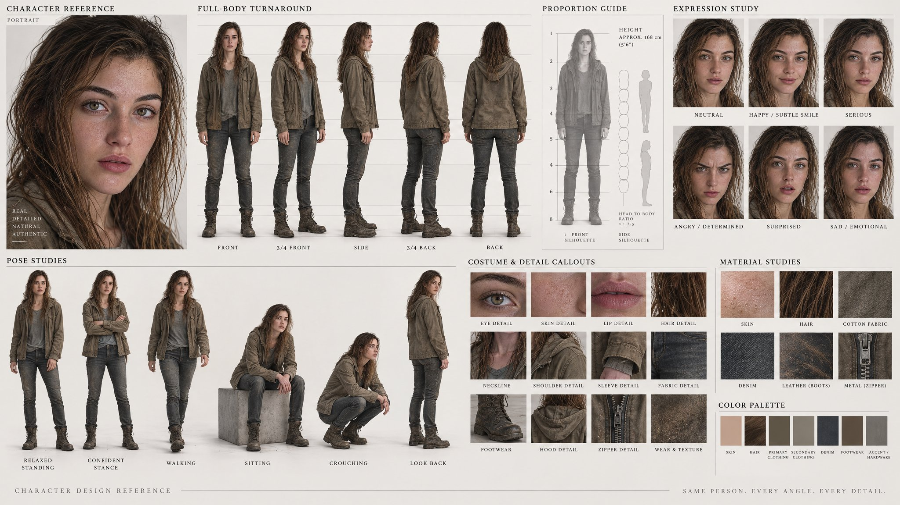

# Character Design Sheet Identity Lock: Turnaround + Full Expression Set

**中文标题：** 角色设定表身份锁：turnaround + 表情全套 prompt  
**ID:** `gi25-x-568` · **Mode:** `edit`  
**Categories:** `character-consistency`, `general`, `edit-change-preserve`  
**Tags:** `x-twitter`, `community`, `gpt-image-2.5`, `xianyu`, `en`



### Character Design Sheet Identity Lock: Turnaround + Full Expression Set

```text
Create a premium professional character design reference sheet / production model sheet based strictly on the provided reference image.  REFERENCE & IDENTITY LOCK: Use the uploaded reference as the single source of truth for the character's identity. Preserve the exact facial identity, facial structure, hairstyle, hairline, eye shape and color, eyebrows, nose, lips, skin tone, body proportions, physique, age appearance, distinctive features, costume design, accessories, footwear, colors, patterns and all recognizable visual details. Do not redesign, beautify, simplify, age, de-age, or reinterpret the character. CHARACTER DESIGN ANALYSIS: Before constructing the sheet, internally analyze and lock the character's:  facial construction head-to-body ratio  body proportions  shoulder width and torso structure  limb length and joint placement  silhouette  hairstyle and hair volume  costume construction  accessory placement  color relationships  material characteristics  distinctive identity anchors  All subsequent views must represent the exact same character design.  PAGE FORMAT: Create one sophisticated studio-grade character reference board, landscape 16:9, clean neutral/off-white studio background, refined editorial production-board aesthetic, highly organized hierarchy, generous spacing, subtle technical guide lines, restrained professional typography-style labels where appropriate, no decorative clutter.  01 — HERO CHARACTER PORTRAIT  Place one larger polished head-and-shoulders or three-quarter portrait as the visual identity anchor. Show the character's canonical facial identity clearly with neutral professional expression and accurate hairstyle, skin, costume and accessories.  02 — FULL-BODY TURNAROUND  Create a clearly organized full-body turnaround showing the same character at identical scale and proportions:  FRONT VIEW  3/4 FRONT VIEW  SIDE PROFILE  3/4 BACK VIEW  BACK VIEW  Use a neutral standing pose with consistent posture and anatomical alignment.  Keep head height, eye line, shoulder line, waist, hips, knees and feet consistently aligned across every view.  The costume, hairstyle, accessories, seams, patterns, footwear and silhouette must remain identical from every angle.  03 — EXPRESSION STUDY  Include a clean expression grid containing approximately 6 expressions:  Neutral  Happy / subtle smile  Serious  Angry / determined  Surprised  Sad / emotional  Maintain the exact same facial identity, head proportions, hairstyle and facial construction in every expression.  Expressions should demonstrate believable facial acting rather than exaggerated deformation.  04 — SIGNATURE POSE STUDIES  Include 4–6 full-body pose studies that communicate the character's personality and physical behavior.  Use varied but believable poses such as:  relaxed standing  confident stance  walking  sitting  interacting with an object  dynamic signature pose  Maintain exact character proportions, costume construction and recognizable silhouette in every pose.  05 — COSTUME & DETAIL CALLOUTS  Add several clean close-up detail panels showing the most important design elements:  hairstyle / hair detail  face detail  collar / neckline  sleeves / garment construction  footwear  jewelry or accessories  distinctive emblem / pattern / texture  important prop if present  Show construction and material clearly without turning the sheet into a decorative fashion collage.  06 — MATERIAL STUDIES  Visually communicate the primary materials present in the design:  fabric, leather, metal, denim, silk, knit, plastic, glass, jewelry, hair, skin or other relevant materials.  Show realistic surface behavior, texture, reflectivity and construction appropriate to each material.  07 — COLOR PALETTE  Include a compact professional color palette strip containing the dominant character colors.  Organize colors according to their visual role:  skin  hair  primary costume  secondary costume  accent color  accessories / materials  Keep the palette faithful to the reference.  08 — PROPORTION & SILHOUETTE GUIDE  Include a subtle technical proportion guide beside the turnaround.  Show:  overall height  head-to-body ratio  major horizontal alignment guides  key body proportions  clean silhouette thumbnail  Keep this section understated and production-oriented.  09 — DESIGN CONTINUITY  Treat the entire page as a single canonical character source of truth.  Every panel must depict the SAME person/character with:  identical facial identity  identical body proportions  identical hairstyle  identical costume  identical accessory placement  identical color palette  identical design language  consistent left/right details  No accidental costume changes, missing accessories, duplicated accessories, altered facial features, changing body proportions, inconsistent hairstyles or unexplained design variations.  VISUAL DIRECTION: High-end professional character design presentation, studio production reference quality, sophisticated concept-art discipline, clean polished rendering, precise construction, controlled neutral lighting, realistic material definition, excellent anatomical consistency, crisp readable details, refined editorial layout, premium art-direction quality.  The sheet should feel like an actual professional animation / game / visual-development production document, not a collection of random AI images.  COMPOSITION: Clear information hierarchy, balanced negative space, aligned panels, consistent character scale, clean grid system, logical visual flow, no overlapping figures, no cropped bodies, no confusing perspective, no unnecessary scenery.  CAMERA / VIEW CONTROL: Turnaround views should use consistent orthographic-like framing and neutral perspective. Expression studies should use a consistent head framing. Pose studies may use natural perspective while preserving character proportions. LIGHTING: Neutral studio illumination designed for design inspection rather than cinematic drama. Soft, even, physically believable light with controlled shadows and accurate material readability.  PHOTOGRAPHIC / RENDER FINISH: Ultra-clean high-end visual development presentation, realistic surface detail, natural skin and hair rendering, physically believable materials, sharp but refined detail, professional production-board finish.  OUTPUT QUALITY: 16K: 15360 × 8640 ≈ 132.7 million pixels, high-resolution professional quality. NEGATIVE CONSTRAINTS: No character redesign, no identity drift, no inconsistent proportions, no changing face, no changing hairstyle, no costume variations, no missing accessories, no duplicated accessories, no extra limbs, no malformed hands, no distorted anatomy, no random props, no dramatic scenery, no cinematic background, no excessive effects, no clutter, no watermark, no logo, no cropped views.
```

- **Recommended model:** `gpt-image-2.5-sunburst`
- **Settings:** _(defaults)_
- **Source:** [community](https://x.com/meAsifAi/status/2098373493662392732) — @meAsifAi (via xianyu110/awesome-gpt-image2.5)
- **License note:** Community X post mirrored in xianyu110/awesome-gpt-image2.5; remix with attribution
- **Notes:** xianyu110 case 2098373493662392732; category=人像角色; verified=True
- **Preview:** `previews/gi25-x-568.jpg`
