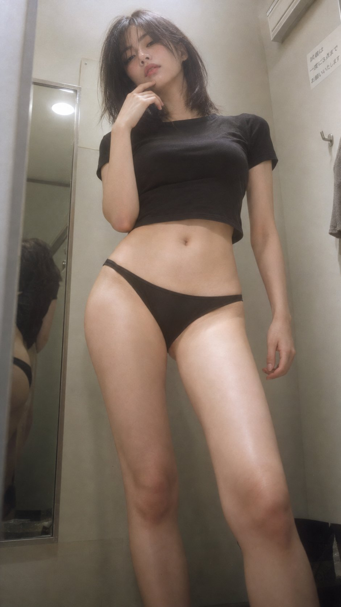

# 90s Japanese Magazine CCD Fitting Room: Highlight-Bloom Recipe

**中文标题：** 90s 日杂 CCD 试衣间：高光溢散配方  
**ID:** `gi25-x-571` · **Mode:** `generate`  
**Categories:** `character-consistency`, `general`  
**Tags:** `x-twitter`, `community`, `gpt-image-2.5`, `xianyu`, `en`



### 90s Japanese Magazine CCD Fitting Room: Highlight-Bloom Recipe

```text
9:16 vertical, ultra-realistic portrait photography, 90s Japanese magazine fitting-room photoshoot style, soft-light CCD texture, obvious highlight bloom and slight haze.
A clearly adult Korean female idol, about 23–27 years old, fair natural skin, slender well-proportioned figure, shoulder-length black straight hair slightly messy and fluffy, long bangs falling naturally and partially covering one eye. Delicate features, haughty and languid expression, slightly looking down at the camera. Soft pink natural makeup, gentle pink lips. Keep real skin texture, fine pores, and natural facial asymmetry.
She wears a black thin cropped short-sleeve T-shirt in soft fitted cotton, hem stopping at the upper abdomen and exposing the waist, midriff, and natural navel. Bottom: black minimalist low-rise bikini-style bottoms, waistline sitting naturally near the hip bones, simple design.
She stands in a small 90s Japanese magazine-style fitting room with light beige-gray walls, a narrow full-length mirror, simple hooks, and soft overhead lighting. Natural standing pose: one leg supporting, the other slightly bent forward, hip shifted naturally to one side. Thinking pose 🤔: one hand raised, index finger lightly resting on the chin, thumb near the jawline, gesture natural and restrained; the other hand hanging naturally at her side. Head slightly tilted, eyes looking down at the camera with a careless, thoughtful look.
Low-angle upward shot, camera close to the subject, slight wide-angle without exaggerated distortion, emphasizing vertical leg extension and slender proportions. Composition includes the head, upper body, full waist and midriff, hips, and most of the legs. Subject occupies the main part of the frame.
Soft hazy lighting. Soft scattered light from the front and above. Slight overexposure on the cheeks, nose bridge, collarbones, shoulders, waist, midriff, and legs, blooming softly outward into clear highlight overflow, halation, bloom, and soft fog. Highlights are creamy white glow; shadows are soft and pale with no hard edges.
Overall low contrast, low saturation, creamy gray and pale warm skin tones, slightly lifted blacks, fine CCD noise and film grain, slightly soft edges, soft-focus filter, and atmospheric haze. Like a casually captured page from a 90s Asian photo magazine.
Photorealistic, real-camera photography, real skin, hair strands, and fabric texture. Soft CCD, highlight bloom, hazy and dreamy but not over-retouched.
Avoid: plastic skin, excessive beautification, over-sharpening, HDR, hard light, strong shadows, anime look, CGI, fisheye, exaggerated wide-angle, limb deformities, extra or wrong fingers, cluttered background, cheap influencer filters.
```

- **Recommended model:** `gpt-image-2.5-sunburst`
- **Settings:** _(defaults)_
- **Source:** [community](https://x.com/BubbleBrain/status/2098315158997307550) — @BubbleBrain (via xianyu110/awesome-gpt-image2.5)
- **License note:** Community X post mirrored in xianyu110/awesome-gpt-image2.5; remix with attribution
- **Notes:** xianyu110 case 2098315158997307550; category=人像角色; verified=True
- **Preview:** `previews/gi25-x-571.jpg`
