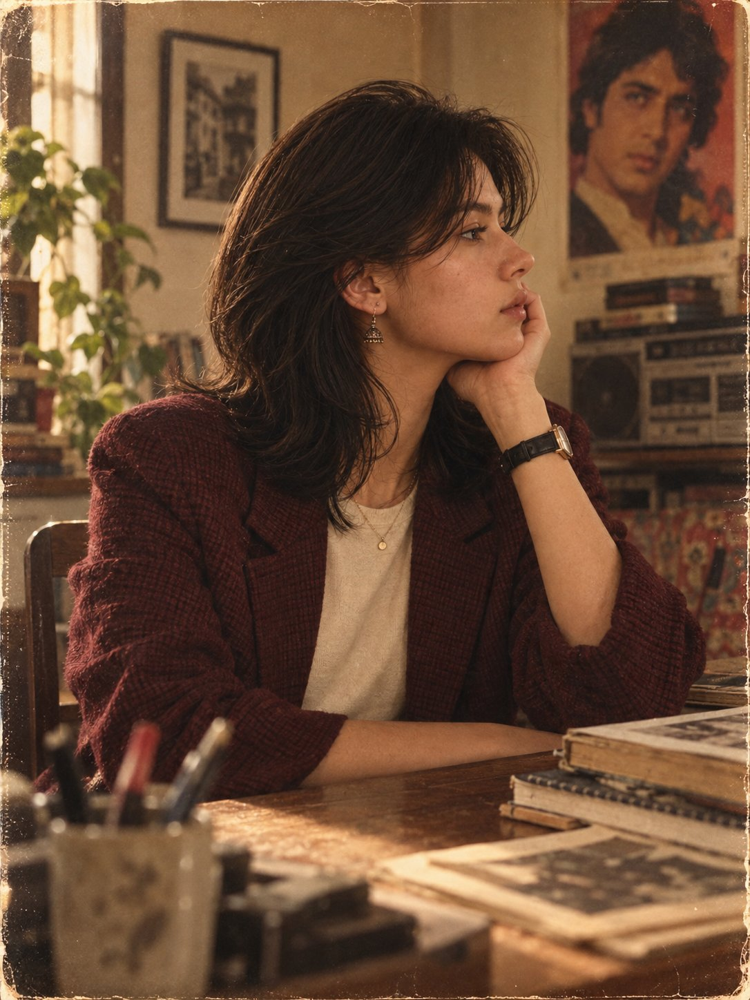

# 1980s Bollywood Fashion Portrait from a Reference: Locked Composition

**中文标题：** 80s 宝莱坞时尚参考图：锁构图出片  
**ID:** `gi25-x-576` · **Mode:** `edit`  
**Categories:** `character-consistency`, `general`, `edit-change-preserve`  
**Tags:** `x-twitter`, `community`, `gpt-image-2.5`, `xianyu`, `en`



### 1980s Bollywood Fashion Portrait from a Reference: Locked Composition

```text
Create a highly realistic cinematic 1980s Bollywood-inspired retro fashion portrait using the uploaded reference as the strict composition and styling guide. One attractive adult model with androgynous styling, natural South Asian features, realistic skin and slightly messy voluminous 80s hair.
Seated casually against a dark polished wooden table, leaning slightly toward the camera. One arm rests on the table while the other holds a vintage cream corded telephone receiver beside the ear. Relaxed editorial pose, direct eye contact, calm confident expression. Waist to mid-thigh framing.
Outfit: loose cream blouse/shirt with voluminous sleeves, high-waisted light-wash jeans, wide black leather belt with aged brass buckle, patterned navy/cream/gold silk scarf, minimal vintage jewelry.
Setting: warm vintage Indian bedroom/living room with dark wood furniture, glowing table lamp, plants, retro Bollywood posters, old cassette/VHS cases and cream rotary telephone base. Background softly blurred.
Warm tungsten lighting, golden-brown shadows, subtle hair rim light. Authentic 35mm film look, 50mm lens, shallow depth of field, soft contrast, faded blacks, natural skin tones, fine film grain, dust, scratches, halation, slight vignette and aged-film imperfections.
Photorealistic, sophisticated, nostalgic, intimate and editorial. Preserve the reference pose, camera angle, environment and overall composition. No modern objects, smartphones, logos, watermark, CGI, plastic skin, distorted anatomy, extra fingers, excessive HDR or oversaturated colors.
3:4 vertical Instagram portrait, high resolution, one person only.
```

- **Recommended model:** `gpt-image-2.5-sunburst`
- **Settings:** _(defaults)_
- **Source:** [community](https://x.com/harboriis/status/2098267933659300039) — @harboriis (via xianyu110/awesome-gpt-image2.5)
- **License note:** Community X post mirrored in xianyu110/awesome-gpt-image2.5; remix with attribution
- **Notes:** xianyu110 case 2098267933659300039; category=人像角色; verified=True
- **Preview:** `previews/gi25-x-576.jpg`
