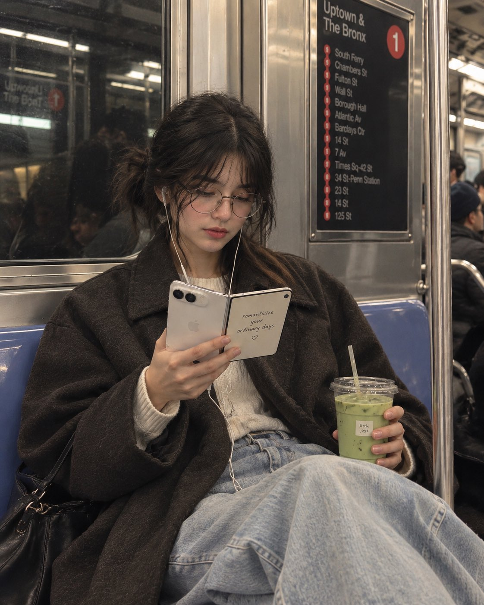

# NYC Subway UGC: Handwritten Quote on a Foldable Phone

**中文标题：** 纽约地铁 UGC：折叠屏手写金句生活照  
**ID:** `gi25-x-578` · **Mode:** `edit`  
**Categories:** `character-consistency`, `general`, `edit-change-preserve`  
**Tags:** `x-twitter`, `community`, `gpt-image-2.5`, `xianyu`, `en`



### NYC Subway UGC: Handwritten Quote on a Foldable Phone

```text
Create a cinematic, candid lifestyle photograph inspired by the reference image, but featuring a young woman sitting comfortably inside a New York City subway.

She has soft, natural features, slightly messy dark hair tied loosely, round vintage-style glasses, and white wired earphones. She is wearing an oversized charcoal-brown coat over a cozy cream knit sweater and relaxed light-wash wide-leg jeans. Her posture is relaxed and natural, with her legs comfortably stretched forward.

She is quietly looking down at an open foldable smartphone in her hands, while holding an iced matcha latte in the other hand. The phone should look premium and realistic, with a clean minimal design.

IMPORTANT — PHONE SCREEN: Replace the original book/quote completely. On the inner screen of the foldable phone, display the elegant handwritten-style quote:

“romanticize your ordinary days ♡”

Make the text clearly visible, beautifully typeset, and naturally integrated into the phone screen.

Set the scene inside a realistic stainless-steel NYC subway carriage, with blue seats, metal panels, subway window reflections, vertical poles, and softly blurred passengers in the background. Include a subtle subway route/sign panel in the background for authentic NYC atmosphere.

The iced matcha cup should have a small minimalist café-style label reading:

“little joys”

Photography & Mood

* candid street-photography aesthetic
* cozy, introspective, effortless mood
* muted earthy tones
* soft natural fluorescent subway lighting
* realistic skin texture
* subtle film grain
* gentle shadows
* slightly desaturated editorial color grading
* shallow depth of field
* authentic reflections and imperfections
* premium fashion-editorial photography
* not overly posed
* not glamorous or studio-like
* photorealistic, believable everyday moment

Composition: vertical 4:5, medium-full body framing, woman centered slightly toward the left, phone and matcha clearly visible, subway environment surrounding her, natural perspective, highly detailed.
```

- **Recommended model:** `gpt-image-2.5-sunburst`
- **Settings:** _(defaults)_
- **Source:** [community](https://x.com/Naiknelofar788/status/2098252670385676491) — @Naiknelofar788 (via xianyu110/awesome-gpt-image2.5)
- **License note:** Community X post mirrored in xianyu110/awesome-gpt-image2.5; remix with attribution
- **Notes:** xianyu110 case 2098252670385676491; category=人像角色; verified=True
- **Preview:** `previews/gi25-x-578.jpg`
