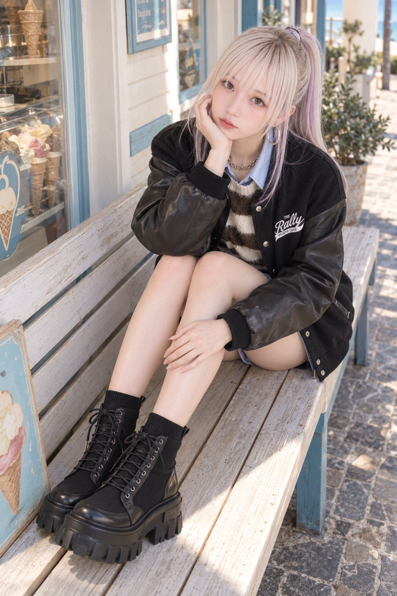

# Layered Outfit Coordination: Fully Swappable Prompt

**中文标题：** 叠穿コーデ 全套可替换 prompt  
**ID:** `gi25-x-583` · **Mode:** `generate`  
**Categories:** `character-consistency`, `general`  
**Tags:** `x-twitter`, `community`, `gpt-image-2.5`, `xianyu`, `en`



### Layered Outfit Coordination: Fully Swappable Prompt

```text
Photorealistic fashion portrait of a single adult woman, vertical 2:3, strongly person-dominant.

POSE AND LEG GEOMETRY:
Sit lengthwise on a deep storefront bench. Keep the pelvis toward frame-right and extend both lower legs forward along the seat toward frame-lower-left.
The knees stay close together and bent, but both ankles are placed well forward of the knees instead of tucked underneath them.
Keep the knees in front of the lap rather than pulled back against the chest.
Show long descending shin lines: each knee-to-ankle segment slopes approximately 25–35 degrees toward frame-left from image vertical.
Both feet rest fully on the bench top, with complete sole contact and visible seating surface beneath them. Keep the feet inside the seat perimeter rather than hanging over its front.
Preserve natural anatomy and the rounded knee bends; do not substitute completely straight legs.

ANATOMICAL LEFT/RIGHT LOCK:
Keep the anatomical left leg nearer the camera and on frame-right within the pair. Keep the anatomical right leg farther from the camera and on frame-left.
Both legs remain uncrossed. The left foot sits slightly farther forward, appearing slightly lower in the image.
Rest the anatomical right elbow on the right knee through a slight forward torso inclination. The right palm supports the right cheek.
Gently tilt the head toward anatomical right, with a calm direct gaze.
The anatomical left forearm drapes diagonally across the knees; the left hand rests along the anatomical right shin, fingers directed toward the right ankle.
Do not mirror, reverse, or exchange these relationships.

CAMERA AND COMPOSITION:
Full-frame camera with a 45mm rectilinear lens.
Camera height approximately 1.60 meters and horizontal distance approximately 1.90 meters from the hips.
Front-left-quarter viewpoint, approximately 35 degrees toward anatomical left from frontal. Photograph across the bench’s outer long side, not straight along the legs.
Downward pitch approximately 24 degrees; roll 0 degrees; optical axis near the waist.
Keep the bench running from lower-left foreground to upper-right background.
Include the full seated figure and both feet at approximately 86–90% of frame height.
Aperture f/5.6, shutter 1/320 sec, ISO 200. Focus on the eyes, with both lower-leg directions and sole-to-seat contacts clearly readable.

WARDROBE-VISIBILITY NON-OPTIMIZATION:
Do not modify knee bends, forward leg extension, foot contacts, arm positions, torso orientation, camera azimuth, height, pitch, focal length, crop, or scale to reveal clothing, footwear, accessories, graphics, or hardware. Preserve natural concealment and original detail placement. Do not rotate the feet for display. The setting must fit the pose.

BACKGROUND AND LIGHTING:
A seaside gelato-shop veranda with a deep wooden or painted bench, pale cream walls, airy coastal trim, a large shop window, and restrained glimpses of blue sky and greenery at the arcade edge. Keep the coastal setting secondary rather than opening into a landscape. Clean coastal daylight and soft sky fill illuminate the face. Background signs are fictional and unreadable.PROTECTED WARDROBE RULE — HIGHEST PRIORITY: Treat each garment description below as its immutable final product identity. Preserve construction, parts, hardware, material, pattern, and every registered graphic or marking—its surface, side, orientation, scale, colors, content, spelling, and count. FINAL WORN STATE overrides only the scoped item's use, position, side, orientation, fastening, layering, folds, tucks, knots, and drape. A SOURCE GARMENT label describes the unstyled item, never the completed silhouette. Do not redesign, add, remove, mirror, duplicate, relocate, or redraw protected details.

Wardrobe:

Hair — final selected state: HAIR GEOMETRY AUTHORITY — Every selected axis below replaces the source hair geometry only on that axis; retain source geometry only for axes explicitly set to Preserve.
TEXTURE CHECKSUM — Straight. Form continuous root-to-tip straight strands with natural body and no wave, curl, or coil pattern. At normal portrait scale, smooth straight strand direction with natural body must remain readable across multiple visible strand groups; one gravity or gathering arc is allowed, but repeating S-waves, ringlets, tight coils, and frizz are not. FRINGE — Keep the exact selected fringe visibly straight with natural body; do not add an S-wave, ringlet, or tight coil pattern to it; apply this to every selected-fringe strand without changing its roots, density, coverage, part, direction, route, or endpoint. MAIN HAIR — apply the same texture consistently to every declared visible hair-bearing cut-excluded section, the complete root-to-anchor scalp lead-in, and the arrangement's final visible tail, bun, twist, or other gathered mass. Texture changes strand path and surface relief only; keep the selected cut silhouette, fringe route, arrangement topology, and endpoints, create no hair merely to display texture, and never texture a shaved or scalp-close skin field. Reject a hybrid result in which only a terminal tail, bun, crest, panel edge, or endpoint carries the selected straight texture while another visible hair-bearing domain remains wavy, curly, coily, or frizzy. GATHERED LAYER CHECK — apply straight strand behavior through every scalp-following route, gathered section, braid, tail, bun, or twist surface; do not release reachable hair merely to display underlying layer endpoints.
CUT VISUAL TARGET — RELEASED SOURCE REFERENCE FOR FULL ARRANGEMENT — Medium layers: Length — collarbone perimeter; Front — shorter jaw-to-upper-neck layer endpoints; Side — intermediate shoulder-side endpoints; Rear — connected upper-neck-to-collarbone progression; Dominant perimeter weight — lower collarbone length remains visible; Layer topology — connected increasing layers with readable front, side and rear endpoints.
FULL ARRANGEMENT CUT VISIBILITY — The released cut geometry is not a competing final hairstyle. Hide every released endpoint belonging to arrangement-assigned hair inside the final gathered structure. Keep the exact selected fringe, selected face framing, every cut-specific arrangement-excluded zone, and every scalp-close or shaved field visible exactly as declared; never hide those retained zones merely because the arrangement mode is full.
ARRANGEMENT VISUAL TARGET — Mid ponytail: Final worn silhouette — exactly one full-volume tail emerging from one middle-occipital center-back anchor; Underlying cut priority — CUT VISUAL TARGET and Cut describe only the source strand lengths and layer topology when fully released before styling; this full arrangement controls the final visible silhouette, so no arrangement-assigned released endpoint may remain visible merely to display the cut, length, or texture; Arrangement mass priority — include every physically reachable arrangement-assigned strand in the declared structure; no reachable assigned hair may remain as an undeclared parallel loose mass; Loose-hair boundary — outside the final gathered structure permit only the exact selected fringe, the exact selected face-framing sections, only structural zones explicitly excluded by the cut-specific arrangement scope, only selected-cut layers genuinely unable to reach their required anchor or local braid pickup; Every exception must stay inside its declared rooted cut zone and must not recreate a duplicate loose version of arrangement-assigned hair, a parallel long curtain, or an undeclared second mass; Reject — a high top-knot, low nape anchor, second tail, loose underlayer, parallel rear curtain, or detached tail; Straight texture — permitted loose exceptions and gathered lead-ins remain straight, with no S-wave, curl, or rippled loose sheet.
Front sections: Fringe — Form a sparse airy fringe from fine separated strands across the forehead, keeping the eyebrows readable and avoiding one solid blunt edge. Keep all wispy strands on the forehead; none becomes a separate face-framing tendril. Face framing — Release exactly one narrow continuous section rooted at each temple and curve it beside the corresponding temple or cheek, ending no lower than the jaw within the selected haircut's available length; create no additional wisps. Keep every face-framing section outside the hair assigned to the Mid ponytail and independently rooted from its main routed structure. Root ownership — The fringe uses only the frontal hairline zone; selected face-framing uses one separate narrow temple-rooted band; all other roots remain in the main cut.
Preserve the natural hairline and exact source hair colors, including roots, highlights, lowlights, accents, and gradients; preserve all unselected hair attributes.
Cut: RELEASED SOURCE REFERENCE FOR FULL ARRANGEMENT — When released, form connected collarbone-length medium layers. Keep the longest lower perimeter at both collarbones; let shorter crown and upper-side layers end around the jaw and upper neck, then pass through intermediate shoulder-side and rear tips in one readable cascade into the collarbone edge. Preserve balanced crown lift, visible jaw-to-upper-neck and shoulder transitions, and a softly weighted collarbone perimeter in the front, sides, and rear. Do not flatten the cut into a one-length lob or turn it into a choppy shag, wolf cut, or pointed nape. Keep one naturally rooted haircut with no retained longer source underlayer, extension, wig edge, or duplicate hair mass.
Arrangement: Arrangement-assigned hair excludes the exact selected fringe and selected face-framing sections. For this varied-length cut, assign every arrangement-assigned strand within the geometry-declared source that can reach its corresponding declared hairstyle anchor from its own root; evaluate reachability to that anchor, not against the complete route or the final tail, braid, bun, or twist length. Keep only strands genuinely too short to reach their corresponding anchor at their selected rooted zones, without extending or reclassifying them; those exceptions must not recreate a duplicate loose version of arrangement-assigned hair, a parallel long curtain, or an undeclared second mass. Use all arrangement-assigned hair; draw both sides symmetrically backward along the scalp toward the middle occipital area. At the hairstyle anchor, use one center-back anchor halfway between the nape hairline and crown apex; let exactly one tail emerge continuously from that base. leave no other free side or back section; create no high top-knot, low nape anchor, second tail, loose underlayer, or detached tail. The route, anchor, result, free-section, and integrity clauses apply only to arrangement-assigned hair; keep every cut-excluded structural zone in the final haircut state declared above.
Measure the selected length on fully extended strands only to calculate underlying source mass and route reachability before gathering; do not compensate for wave, curl, or coil shrinkage when calculating that source mass; the full arrangement, not the released endpoints, controls the final visible silhouette.
Apply the selected texture within the declared arrangement; do not release gathered hair merely to display length or texture.

Outerwear / layers:

A relaxed hip-length black varsity jacket with a dense matte wool-blend body, dropped shoulders and full black leather sleeves with a supple, softly grained sheen. A low black rib-knit stand collar, ribbed cuffs and a broad ribbed waistband frame the boxy shape. Silver-tone snaps close the front, with a closely spaced lower pair at the waistband, and diagonal welt pockets sit at both sides. Small white cursive embroidery reading "Don" sits on the wearer's right chest. The left chest carries a compact white composition reading "THE" above "Rally" in flowing slanted script; the terminal stroke sweeps into a white underline ribbon containing black serif capitals reading "SPORTS CAFE", with a split pointed tail at the ribbon's left end. The same composition appears much larger across the upper back, surrounded by generous black space. Smooth black satin lining completes the interior.

Final worn state:
- Layering: Final state: keep this garment the complete outer layer over the second selected Top item; open only its original center-front fastening run within existing endpoints. Preserve source neckline, collar, front/rear panels, selected shoulder, sleeve, and body positions, plus fastening inventory, receiver mapping, order, spacing, endpoints, and placket length; add, remove, move, or extend nothing. FINAL FASTENING STATE: change only the source-registered primary closure mechanism inside its exact original endpoints. Preserve that mechanism, all original parts, its source length, and the garment construction beyond both endpoints; do not reinterpret a seam, fold, rib, placket, or panel edge as an extension, and add, duplicate, remove, or relocate nothing. Only layer order, contact, occlusion, and optical transmission change. Every visible garment boundary follows the outer item's source geometry or separately selected fold-return line; inner contours remain optically behind it. Keep panel contact shallow. Relaxed handling within this same operation: Use light stable contact and broader material-correct ease without changing the selected layer order.

Top:

An oversized long crew-neck pullover in thick, loosely knitted mohair-blend yarn with a soft shaggy halo and visible stockinette stitches. The straight relaxed body reaches the upper thighs, with dropped shoulders and roomy long sleeves. Ten broad horizontal bands alternate dark chocolate brown and ivory across the torso in approximately equal widths, starting with a brown band interrupted by the neckline and ending with ivory at the hem. The same stripe scale continues around the back and along the sleeves, with softly feathered color boundaries. A brown ribbed crew neck, ivory ribbed cuffs and a broad ivory ribbed hem finish the knit.

A relaxed long light-blue cotton-poplin shirt with a crisp pointed collar on a narrow stand and a full front placket of small pale buttons. The lightly structured woven fabric forms a roomy straight body, long sleeves with buttoned cuffs and a simple back yoke. Rounded shirttails reach the upper thighs, rising at the side seams, with the two front tails separating below the final button. The fabric is plain and smooth throughout.

Final worn state:
For the second item description above only:
- Front closure: Final state: within the original center-front fastening run, disconnect only its upper approximately one-third; keep every original below connected in place. Preserve the source count, type, order, spacing, endpoints, and placket length; never extend the run toward the hem or add, duplicate, remove, or relocate any fastening or receiver FINAL FASTENING STATE: every selected closed position is physically connected to its matching receiver; every selected open position is visibly disconnected, and panel overlap does not imitate a fastening. Preserve the source-defined fastening count, type, spacing, endpoints, and placket length; do not extend the fastening run or add, duplicate, remove, or relocate any fastening or receiver. Change only the selected registered state and leave every unselected component and connection unchanged.
- Layering: Final state: place this garment underneath the first selected Top item across the upper body. the first selected Top item remains the outer garment and retains and owns its exact source neckline aperture and edge, armholes, panel connectivity, closure state, straps, sleeves, and selected final hem or fold-return line. This inner garment contributes appearance only through the outer material's existing optical apertures; no inner contour becomes an outer boundary. Only layer order, contact, occlusion, and optical transmission change. Every visible garment boundary follows the outer item's source geometry or separately selected fold-return line; inner contours remain optically behind it. Keep panel contact shallow. Natural handling within this same operation: Use soft stable contact with limited material-correct ease.

Bottom: Low-rise, close-fitting black hot pants in glossy stretch faux leather, with a smooth contoured waistband, shaped front and back panels, a fitted crotch and very short legs. Narrow stitched hems curve upward at the outer hips and beneath the seat, while subtle seam lines shape the opaque body. A concealed side zipper closes the waistband, keeping the exterior clean and unembellished.

Footwear: A pair of black lace-up platform sock boots with close-fitting rib-knit shafts rising above the ankles and broad ribbed cuffs. The knit continues down the sides and across the vamp beneath smooth black leather-look toe surrounds, heel counters and curved lace facings. Round black laces cross through small loops over knitted tongues, and rear pull tabs assist entry. Rounded closed toes sit above extremely thick black molded soles with sweeping wave-like ridges, angular projecting side blocks, a recessed arch and deep segmented tread. Stretch collars, adjustable lacing and cushioned insoles complete the boots.

Necklace: A silver-tone necklace made from medium-sized rounded oval cable links with open centers and softly polished edges. The links alternate in angle to form a supple, moderately substantial chain that falls in a shallow U at the upper chest. A small rear lobster clasp and short matching extension complete the necklace, with no pendant.

Earrings: A pair of large silver-tone hoop earrings made from slender smooth round wire. The polished circular hoops have open centers and a light, undecorated profile, with small hinged posts closing discreetly at the earlobes.
```

- **Recommended model:** `gpt-image-2.5-sunburst`
- **Settings:** _(defaults)_
- **Source:** [community](https://x.com/MoodLock_JP/status/2097937963523145829) — @MoodLock_JP (via xianyu110/awesome-gpt-image2.5)
- **License note:** Community X post mirrored in xianyu110/awesome-gpt-image2.5; remix with attribution
- **Notes:** xianyu110 case 2097937963523145829; category=人像角色; verified=True
- **Preview:** `previews/gi25-x-583.jpg`
