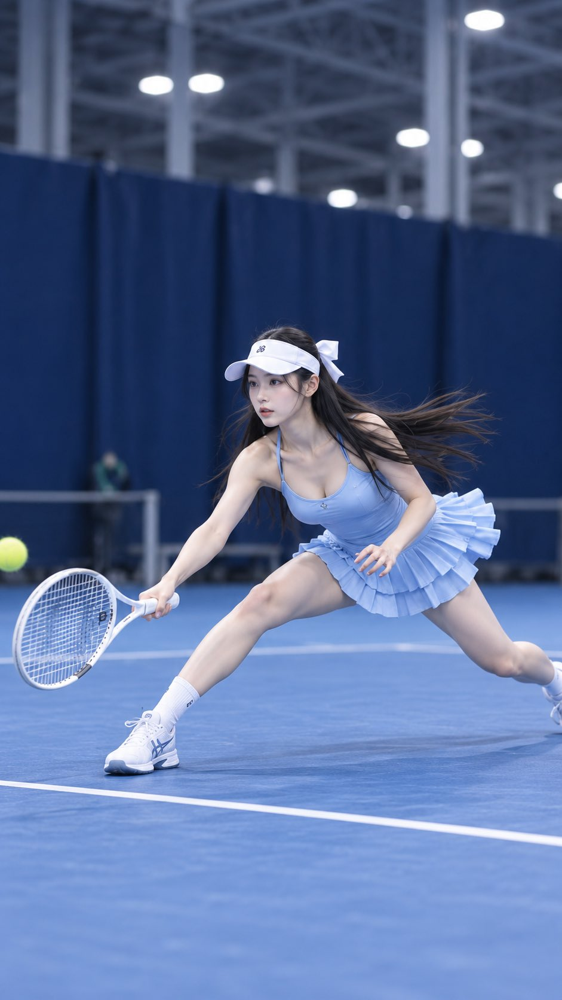

# Indoor Tennis Photoshoot: Full Chinese Prompt

**中文标题：** 网球写真完整中文 prompt  
**ID:** `gi25-x-587` · **Mode:** `generate`  
**Categories:** `character-consistency`, `general`  
**Tags:** `x-twitter`, `community`, `gpt-image-2.5`, `xianyu`, `zh`



### Indoor Tennis Photoshoot: Full Chinese Prompt

```text
室内网球写真抓拍，9:16；18–22 岁、明确成年的漂亮东亚女性，约 1.75 米，精致窄长鹅蛋脸，冷白透亮肌肤，高挑纤细模特身材。黑色超长直发，白色空顶帽带蝴蝶结，浅天蓝色细吊带运动背心 × 同色系多层荷叶短裙，白色网球拍，清新又有活力。

💙 专业蓝色硬地网球场，深蓝围挡，明亮柔和顶光，85mm 运动抓拍感。整体清新蓝白色调，人物全身完整入镜，偏侧颜、神情专注、嘴唇微张，皮肤、发丝、纱裙褶皱与球拍细节清晰，真实运动写真感。

随机动作池：

🎾 侧身弓步预备接球，双手握拍，目光紧盯侧方来球
💨 向左侧快速跨步，球拍前伸准备拦截
🩵 半蹲压低重心，双腿弯曲，准备反手接球
🏃🏻‍♀️ 接球前瞬间急停，长发与裙摆轻微扬起
✨ 双手持拍放在身前，身体前倾进入防守姿态
🌀 刚完成一次小碎步调整，回头锁定来球方向
🎯 单脚前踏、另一脚蹬地，球拍微抬，专注等待来球
🌬️ 低重心侧移，裙摆与碎发轻轻甩动，形成动态抓拍感

🎲 围绕不同动作自由发挥机位、弓步幅度、挥拍方向、发丝动态、裙摆层次与场馆光线，保持人体结构、手部握拍和运动姿态自然，追求网球少女 × 清新运动感 × 高级体育写真抓拍氛围。

出一张包含不同动作的综合预览图，让我从中选择。
```

- **Recommended model:** `gpt-image-2.5-sunburst`
- **Settings:** _(defaults)_
- **Source:** [community](https://x.com/AIVideoHub_/status/2097878838063903217) — @AIVideoHub_ (via xianyu110/awesome-gpt-image2.5)
- **License note:** Community X post mirrored in xianyu110/awesome-gpt-image2.5; remix with attribution
- **Notes:** xianyu110 case 2097878838063903217; category=人像角色; verified=True
- **Preview:** `previews/gi25-x-587.jpg`
