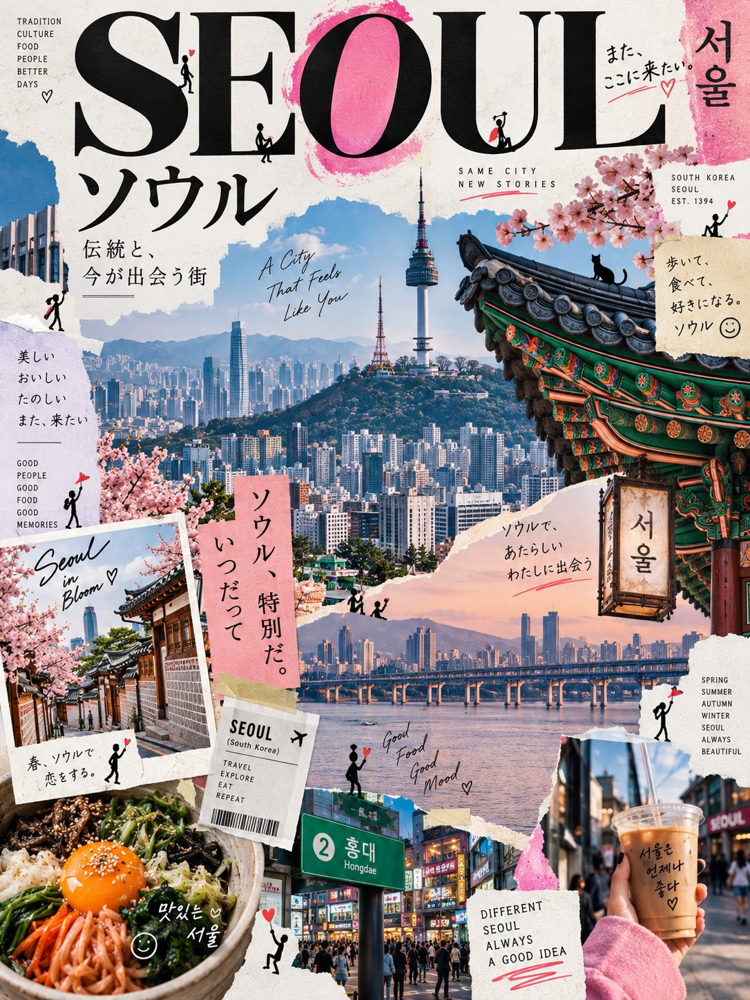

# Editorial Art Poster for a Location

**中文标题：** 地点主题编辑艺术海报  
**ID:** `gi25-x-599` · **Mode:** `edit`  
**Categories:** `character-consistency`, `edit-change-preserve`  
**Tags:** `x-twitter`, `community`, `gpt-image-2.5`, `atlascloud`, `en`



### Editorial Art Poster for a Location

```text
Create a premium contemporary editorial art poster for [LOCATION] in a playful Japanese design-ZINE style.

FORMAT: Vertical 3:4 | High resolution | Modern editorial art

Automatically choose the most iconic and visually interesting-elements of [LOCATION]-landmarks, architecture, streets, landscapes, food, nature, transportation, or cultural details—and build the artwork around the strongest subject.

Use a bold full-frame collage composition, with the main subject occupying about 70–90% of the image. Combine dramatic crops, enlarged details, cutout elements, layered paper shapes, small image fragments, irregular edges, and overlapping graphics. Avoid large empty spaces, but keep everything clean and professionally art-directed.

Automatically extract 2–4 signature colors from the character of [LOCATION] and use them for translucent shapes, circles, brush strokes, watercolor marks, lines, arrows, symbols, and small hand-drawn motifs.

Add a strong combination of English + Japanese typography:

A short, original English title inspired by the location

A complementary Japanese title expressing its mood or story

2–4 small Japanese editorial captions

Minimal English/Japanese details such as place, season, date, or atmosphere

Use elegant serif or modern sans-serif English typography and refined Japanese Mincho or Gothic lettering. Allow some text to overlap the imagery or extend slightly beyond the frame for an editorial feel.

Add one small handwritten Japanese message, naturally drawn with a thin black pen, inspired by the scene.

Include 5–10 tiny black stick figures throughout the design. Give each a different playful action—climbing letters, pulling arrows, carrying shapes, observing the landmark, sitting on the image edge, holding a tiny flag, or interacting with the artwork. Keep them small and subtle, with only a few using accent-colored accessories.

FINAL LOOK

Make it feel like a lively little magazine created from [LOCATION]—a sophisticated combination of contemporary Japanese design, independent magazines, art books, fashion editorials, and gallery-shop ZINEs.

Bright, fresh, artistic, playful, and highly polished. Not a traditional tourist poster, generic advertisement, vintage poster, or ordinary AI illustration.

No reference image required. Generate the entire visual concept from [LOCATION] alone.
```

- **Recommended model:** `gpt-image-2.5-sunburst`
- **Settings:** _(defaults)_
- **Source:** [community](https://x.com/Goodmanprotocol/status/2098025936721707252) — @Goodmanprotocol (via AtlasCloudAI/awesome-gpt-image-2.5-prompts)
- **License note:** CC BY 4.0 (AtlasCloudAI/awesome-gpt-image-2.5-prompts); original X post — remix with attribution
- **Notes:** AtlasCloudAI record 920; category=Reference Fidelity; prompt text taken from the original X post; verified=True
- **Preview:** `previews/gi25-x-599.jpg`
