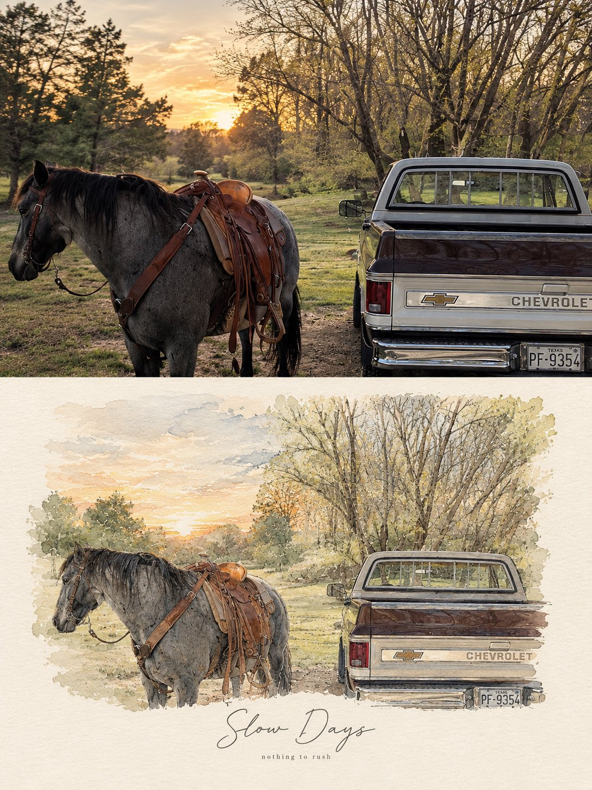

# Photo-Based Minimal Watercolor Vignette Artwork

**中文标题：** 照片 + 极简水彩小品拼版  
**ID:** `gi25-x-601` · **Mode:** `edit`  
**Categories:** `character-consistency`, `edit-change-preserve`  
**Tags:** `x-twitter`, `community`, `gpt-image-2.5`, `atlascloud`, `en`



### Photo-Based Minimal Watercolor Vignette Artwork

```text
Create a refined, high-end PHOTO + MINIMAL WATERCOLOR VIGNETTE artwork based entirely on the uploaded photograph. Use the photograph as the only visual reference and preserve the exact subject, composition, environment, clothing, objects, lighting, colors, and mood.

FORMAT: Vertical 3:4 editorial composition.

TOP SECTION — ORIGINAL PHOTOGRAPH:
Place the original photograph in the upper 55–60% of the canvas. Keep it photorealistic and naturally detailed. Do not alter the identity, pose, proportions, objects, architecture, scenery, or important visual details. Give it a subtle premium editorial photography finish with natural cinematic light and gentle tonal balance.

BOTTOM SECTION — HAND-PAINTED INTERPRETATION:
Transform the same exact scene into a delicate minimal watercolor and fine-ink illustration. Recreate the main subject, pose, perspective, key objects, and recognizable background elements from the photograph. Use loose watercolor washes, subtle pencil/ink outlines, imperfect hand-painted edges, soft paper texture, and restrained pastel tones. Keep the illustration airy, elegant, and slightly imperfect rather than digitally polished.

The illustration should feel like a fashion/lifestyle magazine sketchbook page, with plenty of clean negative space and a warm off-white textured paper background. Do not introduce new subjects or details.

TYPOGRAPHY:
Add a short elegant handwritten brush-script phrase underneath or integrated naturally into the illustrated section, similar to a premium lifestyle editorial poster. Underneath it, add a tiny minimalist lowercase serif/sans-serif subtitle. Typography should be subtle, sophisticated, thin, and balanced with the artwork.

AESTHETIC:
Scandinavian editorial design, quiet luxury, nostalgic travel journal, soft watercolor, delicate ink drawing, handmade paper texture, muted natural palette, sophisticated minimalism, emotional storytelling, premium art-book layout.

IMPORTANT: The photograph and illustration must clearly represent the same exact moment and scene. No collage of unrelated images, no dramatic redesign, no excessive watercolor, no cartoon appearance, no heavy outlines, no saturated colors, no clutter.

Output: photorealistic upper section + matching delicate watercolor illustration below, seamless premium editorial composition, vertical 3:4, high detail.

For different photos, just change the text phrase

Examples:
•Good Days — a kinder me
•Better Together — same window, same silence
•Little Moments — worth remembering
•Slow Days — nothing to rush
•Somewhere Quiet — just for a while
•Golden Hours — softly remembered
```

- **Recommended model:** `gpt-image-2.5-sunburst`
- **Settings:** _(defaults)_
- **Source:** [community](https://x.com/Naiknelofar788/status/2098053997588557855) — @Naiknelofar788 (via AtlasCloudAI/awesome-gpt-image-2.5-prompts)
- **License note:** CC BY 4.0 (AtlasCloudAI/awesome-gpt-image-2.5-prompts); original X post — remix with attribution
- **Notes:** AtlasCloudAI record 1186; category=Reference Fidelity; prompt text taken from the original X post; verified=True
- **Preview:** `previews/gi25-x-601.jpg`
