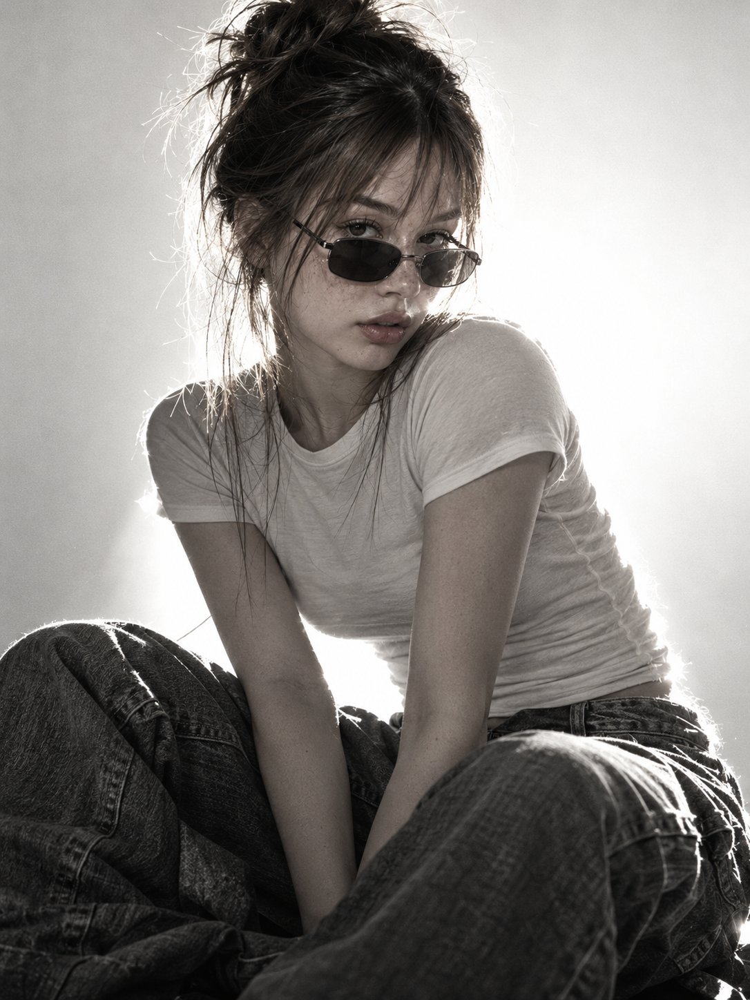

# Backlit B&W Fashion Portrait from a Character Sheet

**中文标题：** 角色设定图→黑白逆光时装棚拍  
**ID:** `gi25-x-657` · **Mode:** `edit`  
**Categories:** `character-consistency`, `edit-change-preserve`  
**Tags:** `x-twitter`, `community`, `gpt-image-2.5`, `x-direct`, `en`



### Backlit B&W Fashion Portrait from a Character Sheet

```text
Use the uploaded character sheet as the MASTER IDENTITY REFERENCE.

Create an ultra-photorealistic black-and-white high-fashion studio portrait of the exact same adult woman. Preserve her face, freckles, facial proportions, messy brown high bun with loose wispy bangs, natural skin texture and narrow dark sunglasses. Strict identity lock — no beautification or facial changes.

She wears a fitted light/white T-shirt with oversized dark baggy jeans, seated in a relaxed sculptural pose with her body slightly turned toward camera and bent knees creating depth in the foreground. Direct, confident, slightly mysterious eye contact.

Use a powerful light directly behind her, producing an almost overexposed white background and intense rim light around her hair, shoulders and clothing. Keep the face partially in soft shadow while remaining clearly recognizable. Deep blacks, bright highlights, dramatic contrast.

Premium 50–85mm fashion photography, sharp facial focus, realistic depth of field, detailed denim and cotton textures, visible pores, freckles, flyaway hairs and subtle analog film grain. Raw grunge × minimalist luxury editorial aesthetic.

100% real human photography — no AI look, CGI, plastic skin, beauty filter, distorted anatomy, extra fingers, warped clothing, text, logos or watermark.
```

- **Recommended model:** `gpt-image-2.5-sunburst`
- **Settings:** _(defaults)_
- **Source:** [community](https://x.com/TheVirtualMuse/status/2107101271736156300) — @TheVirtualMuse
- **License note:** Original public X post; quoted with attribution — remix with attribution
- **Notes:** Collected directly from X; original post https://x.com/TheVirtualMuse/status/2107101271736156300 (prompt posted as the author's reply to https://x.com/TheVirtualMuse/status/2107101064998908375, which carries the images); post text names GPT Image 2.5; verified=True
- **Preview:** `previews/gi25-x-657.jpg`
