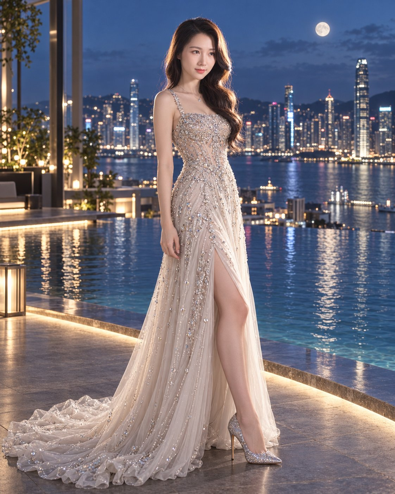

# Infinity-Pool Couture Evening Portrait from Reference

**中文标题：** 参考图→无边泳池高定晚礼服人像  
**ID:** `gi25-x-662` · **Mode:** `edit`  
**Categories:** `character-consistency`, `edit-change-preserve`  
**Tags:** `x-twitter`, `community`, `gpt-image-2.5`, `x-direct`, `en`



### Infinity-Pool Couture Evening Portrait from Reference

```text
Use the uploaded image as the exact visual and facial reference. Preserve the woman’s facial identity, facial proportions, hairstyle, and overall appearance with zero identity drift. -- ar 4:5

Create a photorealistic cinematic luxury evening portrait of the same woman standing beside a calm infinity pool overlooking a modern waterfront city skyline at blue hour/night. She wears an elegant floor-length silver-white couture gown with delicate crystal embellishments, thin straps, a fitted embellished bodice, flowing pleated skirt, and a subtle train. Add matching sparkling silver high heels.

Keep the same graceful side-profile pose as the reference: body slightly turned sideways toward the camera, shoulders relaxed, one arm naturally resting beside her body, elegant posture, soft confident gaze directly toward the camera.

The pool should reflect the surrounding city lights naturally. In the background, show a sophisticated modern skyline with tall illuminated towers, softly blurred for cinematic depth of field. Include a realistic, naturally sized full moon in the upper sky — not oversized — with subtle moonlight illuminating the scene. Gentle evening breeze moves a few strands of her hair and the gown slightly.

Lighting: realistic moonlight mixed with soft ambient architectural lighting, subtle highlights on the silver dress, natural skin tones, realistic shadows, cinematic contrast, soft atmospheric haze.

Camera: full-body composition, eye-level camera, 85mm portrait lens, shallow depth of field, realistic bokeh, sharp subject, detailed fabric texture, natural skin pores.

Style: high-end luxury fashion editorial, cinematic photography, ultra-photorealistic, sophisticated, elegant, realistic proportions, natural skin texture, no artificial AI appearance.

Negative prompt: identity change, face drift, different person, altered facial features, oversized moon, plastic skin, excessive retouching, distorted hands, extra fingers, warped body, unnatural pose, cartoon, CGI look, oversaturated colors, excessive glow, duplicate person, blurry face, watermark, text, logo.
```

- **Recommended model:** `gpt-image-2.5-sunburst`
- **Settings:** _(defaults)_
- **Source:** [community](https://x.com/WanderingC76/status/2106932053749232038) — @WanderingC76
- **License note:** Original public X post; quoted with attribution — remix with attribution
- **Notes:** Collected directly from X; original post https://x.com/WanderingC76/status/2106932053749232038 (prompt posted as the author's reply to https://x.com/WanderingC76/status/2106931897834311716, which carries the images); post text names GPT Image 2.5; verified=True
- **Preview:** `previews/gi25-x-662.jpg`
