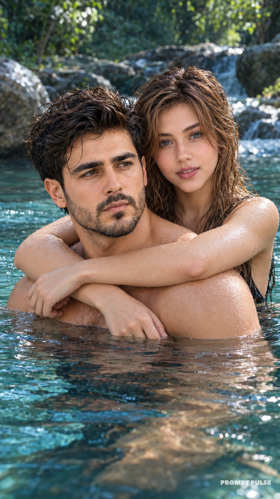

# Natural-Water Couple Portrait from Reference

**中文标题：** 参考图情侣戏水电影感人像  
**ID:** `gi25-x-668` · **Mode:** `edit`  
**Categories:** `character-consistency`, `edit-change-preserve`  
**Tags:** `x-twitter`, `community`, `gpt-image-2.5`, `x-direct`, `en`



### Natural-Water Couple Portrait from Reference

```text
Hyper-realistic IMAX-level Netflix-style cinematic natural-water couple portrait, 9:16 vertical. Use the uploaded image as the primary visual reference and preserve the exact facial identity, proportions, and defining features. Create a couple standing close together in calm waist-deep natural water, both partially submerged; the man is positioned in the foreground with his upper body turned slightly toward the left side of the frame while his face turns further left toward the camera, shoulders relaxed and head held naturally, while the woman stands directly behind him with her body mostly hidden by his shoulders, both arms wrapped comfortably around his shoulders and upper chest from behind, her forearms crossing naturally in front of him and her hands resting near his opposite shoulder, creating a close natural couple pose; the man has a calm, slightly serious expression with relaxed eyes looking toward the left side of the frame, while the woman looks directly toward the camera from behind his shoulder with a soft composed expression and gently parted lips; both have wet hair, the man's light blond hair falling naturally in damp loose strands across his forehead and sides, while the woman's long dark hair is wet and loosely swept back with damp strands falling around her face and neck; both wear simple dark swimwear that remains mostly below the waterline and is minimally visible; fair luminous natural skin with realistic wet texture, tiny water droplets across the shoulders and hair, and soft reflected highlights from the surrounding water; a secluded forest stream or natural pool surrounds them with dark green foliage, large pale rocks and softly moving turquoise-blue water in the background, while the waterline crosses the lower part of the frame and gentle ripples spread around their bodies; soft diffused daylight filters through the surrounding trees, creating subtle highlights on wet hair, shoulders and water droplets without harsh shadows; deep teal and cool green colour grading dominates the scene, with rich forest greens, muted cyan-blue water, slightly warm natural skin tones, cool shadows, restrained saturation, medium-low contrast, soft blacks, subtle atmospheric haze, gentle film grain and a smooth cinematic filter that gives the image a quiet, intimate outdoor-film atmosphere while keeping the water and wet textures highly realistic. Negative prompt: changed identity, incorrect couple pose, wrong arm placement, extra fingers, distorted anatomy, dry hair, dry skin, unrealistic water, artificial background, harsh lighting, text, watermark.
```

- **Recommended model:** `gpt-image-2.5-sunburst`
- **Settings:** _(defaults)_
- **Source:** [community](https://x.com/imGopalTiwari/status/2108089762015760819) — @imGopalTiwari
- **License note:** Original public X post; quoted with attribution — remix with attribution
- **Notes:** Collected directly from X; original post https://x.com/imGopalTiwari/status/2108089762015760819; post text names GPT Image 2.5; verified=True
- **Preview:** `previews/gi25-x-668.jpg`
