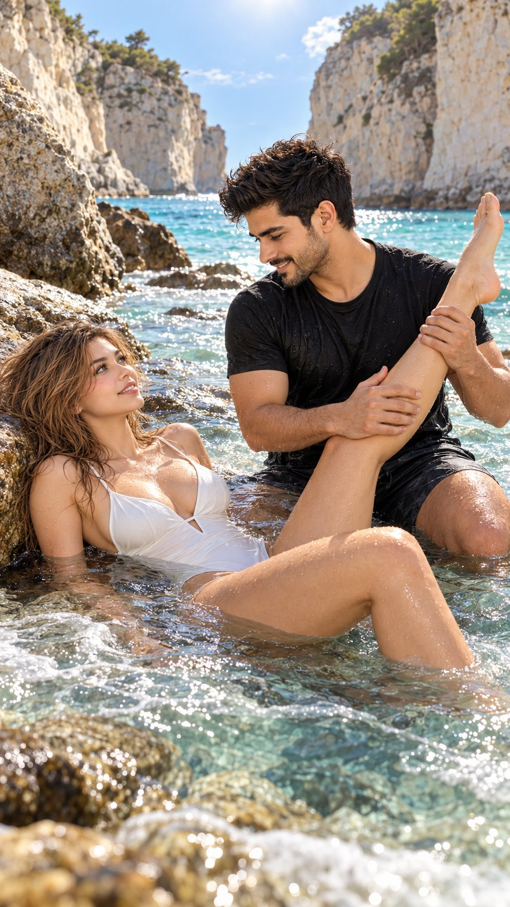

# Coastal Couple Portrait from Two Character Sheets

**中文标题：** 双角色设定图→海边情侣人像  
**ID:** `gi25-x-669` · **Mode:** `edit`  
**Categories:** `character-consistency`, `edit-change-preserve`  
**Tags:** `x-twitter`, `community`, `gpt-image-2.5`, `x-direct`, `en`



### Coastal Couple Portrait from Two Character Sheets

```text
Hyper-realistic IMAX-level Netflix-style cinematic coastal couple portrait, 9:16 vertical. Use the uploaded female and male character reference sheets as the primary identity references and preserve each character’s exact facial identity, facial proportions, defining facial features, hairstyle, hair colour, natural body proportions, and overall appearance consistently throughout the image. Create the same couple sharing a playful, affectionate and completely natural summer moment together in the shallow seawater of a secluded rocky coastal cove. The woman wears a simple elegant white one-piece swimsuit, while the man wears a plain black short-sleeve T-shirt and dark casual shorts. Compose the couple so their entire lower-body anatomy is clearly readable and physically coherent. The woman is reclining sideways in the shallow water with her upper back and shoulders supported naturally by the water and smooth submerged rocks, her head positioned toward the left side of the frame, face turned upward toward the man, with a relaxed playful smile. Her damp light-brown hair spreads naturally across the wet rock and water behind her head, with individual water-darkened strands around her neck and shoulders. Her two legs must be completely separate, anatomically continuous and clearly traceable from hip to foot. Her first leg is bent naturally at the knee and raised beside the man, with the thigh emerging clearly from her hip, the knee fully defined, the calf continuing naturally upward behind and slightly beside the man, followed by a clearly visible ankle and bare foot; the entire raised lower leg must remain visually connected and must never appear to emerge from the man's shoulder or torso. Her second leg remains independently bent in front of and slightly below the first leg, with its own clearly visible thigh, knee and lower leg continuing naturally into the shallow water; this second leg is partially submerged but its anatomical direction remains understandable. Keep both knees distinct and spatially separated, with no crossing or merging of the legs. Do not hide either knee behind the man's body. The man is seated or kneeling naturally opposite her in the shallow water, both knees bent and positioned independently, torso leaning slightly toward her. He gently supports the calf/shin portion of her raised leg with both hands, with anatomically correct hand placement and believable contact, while keeping his torso completely separate from the leg. His arms, hands, elbows and shoulders must remain anatomically connected to his body. His other body parts must never overlap or visually merge with her legs. He looks down toward her with a genuine, relaxed smile and natural eye contact, creating an affectionate, candid beach interaction rather than a posed studio composition. His short dark hair is naturally tousled, slightly wet and textured, with realistic individual strands. Preserve realistic facial structure, natural skin texture and believable body proportions for both characters, with luminous fair skin tones, subtle natural complexion variation, realistic wet-skin texture and small water droplets across their exposed skin. Surround them with towering pale cream limestone cliffs forming a secluded coastal cove, vivid turquoise and aqua seawater behind them, shallow transparent waves flowing naturally around their bodies and spreading across the foreground, wet dark rocks partially visible beneath the water, and bright open blue sky visible above the cliffs. Warm natural sunlight enters from the upper center behind the cliffs, producing delicate rim lighting around their hair and shoulders, sparkling reflections across the moving water, subtle highlights on wet skin, and bright illuminated foam in the foreground. Use cinematic coastal colour grading with turquoise and aqua water, warm cream limestone cliffs, natural skin tones, slightly warm white balance, luminous highlights, gentle directional shadows, moderate cinematic contrast, subtle film grain, soft atmospheric depth and a clean sunlit summer look. Preserve realistic water movement, transparent shallow-water depth, individual foam bubbles, wet-rock reflections and physically accurate interaction between skin, clothing and water. Position the camera at low water level, slightly above the surface but far enough away to avoid extreme perspective distortion of the woman's foreground leg, using a medium-wide cinematic composition that clearly captures both faces, both complete leg structures, the man's supporting hands, their coordinated body positions and the surrounding coastal environment. Keep the woman's raised leg within the same perspective scale as her body; do not enlarge the foreground thigh or knee disproportionately. Maintain clear visual separation between every limb and torso. Use natural perspective, realistic lens rendering, subtle background separation, highly detailed water droplets and fabric texture, photorealistic anatomy, physically accurate joints, realistic hands and feet, premium cinematic photography, IMAX-scale environmental detail, 60mm cinematic lens look, natural depth of field, high dynamic range, ultra-detailed 8K realism. Anatomical priority: every limb must have one continuous believable connection from its origin to its extremity; both legs must be visibly distinguishable; both knees, ankles and feet must correspond to the correct legs; no limb may disappear behind another body part and reappear somewhere else; no floating feet, disconnected calves, duplicated legs, merged thighs, hidden joints, impossible bends or ambiguous limb connections. Negative prompt: changed identity, inconsistent facial features, incorrect hairstyle, incorrect clothing, distorted face, bad anatomy, disproportionate limbs, oversized foreground leg, duplicated legs, missing leg, wrong legs, extra leg, merged legs, fused thighs, disconnected thigh, disconnected calf, floating foot, floating limb, missing knee, hidden knee, duplicated knee, impossible knee bend, twisted leg, reversed leg, broken ankle, distorted feet, unnatural leg angle, limb emerging from torso, limb emerging from shoulder, limb passing through body, overlapping limbs, fused body parts, extra arms, missing arms, malformed hands, extra fingers, unrealistic hand placement, floating body parts, unnatural body connection, incorrect water interaction, plastic skin, excessive retouching, oversaturated colours, flat lighting, text, logo, watermark.
```

- **Recommended model:** `gpt-image-2.5-sunburst`
- **Settings:** _(defaults)_
- **Source:** [community](https://x.com/imGopalTiwari/status/2108073045315510274) — @imGopalTiwari
- **License note:** Original public X post; quoted with attribution — remix with attribution
- **Notes:** Collected directly from X; original post https://x.com/imGopalTiwari/status/2108073045315510274; post text names GPT Image 2.5; verified=True
- **Preview:** `previews/gi25-x-669.jpg`
