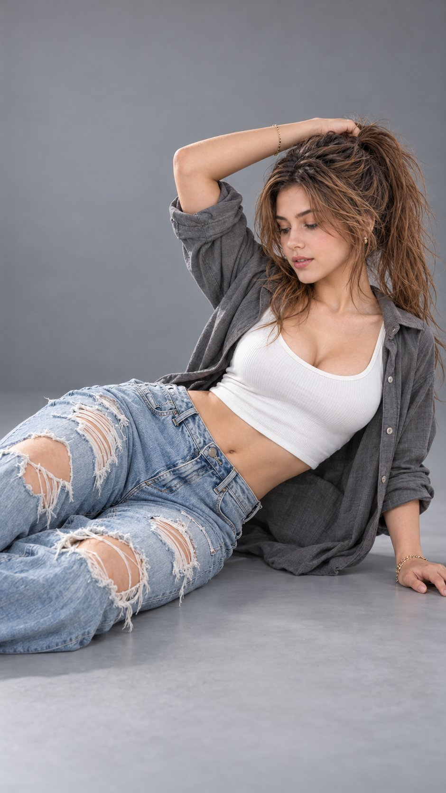

# Netflix-Style Studio Fashion Portrait from Reference

**中文标题：** 参考图→Netflix 风棚拍时装人像  
**ID:** `gi25-x-687` · **Mode:** `edit`  
**Categories:** `character-consistency`, `edit-change-preserve`  
**Tags:** `x-twitter`, `community`, `gpt-image-2.5`, `x-direct`, `en`



### Netflix-Style Studio Fashion Portrait from Reference

```text
Hyper-realistic IMAX-level Netflix-style cinematic studio fashion portrait, 9:16 vertical. Use the uploaded image as the primary visual reference and preserve the exact facial identity, proportions, and defining features. Create a woman wearing a fitted white scoop-neck crop top, an open oversized grey button-up shirt with loose sleeves casually pushed toward her elbows, and light-blue high-waisted jeans with prominent distressed rips and frayed edges across the thighs and knees, accessorized with delicate gold bracelets and subtle earrings. She is reclining sideways on a smooth studio floor, her body extending diagonally from the lower left toward the upper right of the frame; her hips and legs rest on the floor with both legs bent naturally at different angles, the upper leg slightly forward, while her lower arm extends along the floor toward the right with her palm resting down and fingers relaxed. Her other arm curves over her head, elbow raised, hand resting against the crown of her head and gathering her high ponytail. Her head tilts downward toward her shoulder, eyes lowered toward the floor, eyebrows relaxed and lips slightly parted, creating a calm, composed fashion-editorial expression. Her long dark brown hair is styled in a high ponytail with loose strands falling over her shoulder and down behind her head. Fair luminous skin with a natural ivory-beige tone, realistic texture and soft highlights. A seamless matte grey studio backdrop and matching floor create a clean, minimal setting with generous empty space above and around her. Large softbox lighting from the upper left creates gentle highlights on her face, exposed midriff and denim, with smooth shadows beneath her body and subtle contouring along the grey shirt. Cool-neutral colour grading with slate-grey tones, muted blue denim, crisp white fabric, balanced skin warmth, restrained saturation and soft cinematic contrast, finished with realistic fabric texture and shallow, controlled depth of field. 
Negative prompt: changed identity, incorrect body position, misplaced arms, extra fingers, deformed hands, unnatural joints, distorted face, excessive skin smoothing, text, watermark.
```

- **Recommended model:** `gpt-image-2.5-sunburst`
- **Settings:** _(defaults)_
- **Source:** [community](https://x.com/imGopalTiwari/status/2108421292734980125) — @imGopalTiwari
- **License note:** Original public X post; quoted with attribution — remix with attribution
- **Notes:** Collected directly from X; original post https://x.com/imGopalTiwari/status/2108421292734980125; post text names GPT Image 2.5; verified=True
- **Preview:** `previews/gi25-x-687.jpg`
